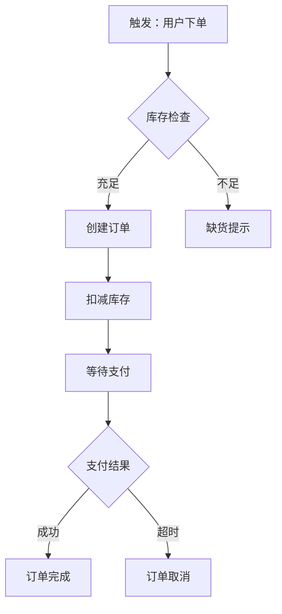

# 业务建模规范

完整的业务角色、流程、活动、规则定义规范，确保 PRD 业务覆盖全面。

---

## 一、业务角色模型

### 1.1 角色定义模板

每个业务角色需完整定义以下内容：

```markdown
#### R01 [角色名称]

**角色概述**
| 属性 | 定义 |
|------|------|
| 角色名称 | [角色中文名] |
| 角色英文名 | [英文标识，如 admin/operator] |
| 角色类型 | 系统角色 / 业务角色 / 外部角色 |
| 角色层级 | 管理层 / 执行层 / 外部层 |

**角色职责**
- 负责 [业务领域A] 的 [具体职责]
- 负责 [业务领域B] 的 [具体职责]

**操作范围**
| 数据类型 | 操作权限 |
|----------|----------|
| [实体A] | 查看 / 创建 / 编辑 / 删除 / 审批 |
| [实体B] | 查看 / 仅本人数据 |

**协作关系**
- 与 [角色A] 协作：[协作场景，如提交审批]
- 与 [角色B] 协作：[协作场景，如任务分配]

**角色约束**
- 限制：[限制条件，如只能操作本人数据]
- 禁止：[禁止行为，如不能删除他人数据]
```

### 1.2 角色分类

| 角色类型 | 说明 | 示例 |
|----------|------|------|
| **系统角色** | 系统内置角色，权限固定 | 超级管理员、系统管理员 |
| **业务角色** | 业务定义的角色，可配置权限 | 业务经理、审批人、操作员 |
| **外部角色** | 外部系统或用户角色 | 供应商、客户、合作伙伴 |

### 1.3 组织架构定义

```
组织层级：
├── 公司层
│   ├── CEO（R01）
│   └── CFO（R02）
├── 部门层
│   ├── 销售部
│   │   ├── 销售总监（R03）
│   │   ├── 销售经理（R04）
│   │   └── 销售员（R05）
│   └── 运营部
│       ├── 运营总监（R06）
│       └── 运营专员（R07）
└── 外部层
    ├── 供应商（R08）
    └── 客户（R09）
```

**角色层级关系矩阵**：

| 上级角色 | 下级角色 | 管理关系 |
|----------|----------|----------|
| R01 CEO | R03/R06 部门总监 | 审批部门决策 |
| R03 销售总监 | R04/R05 销售人员 | 分配任务、审批申请 |
| R04 销售经理 | R05 销售员 | 分配客户、审核业绩 |

---

## 二、业务流程矩阵

### 2.1 流程分类

| 流程类型 | 定义 | 数量规则 | 优先级 |
|----------|------|----------|--------|
| **主流程** | 核心业务主线，支撑核心价值 | ≥3节点必须给出，按实际复杂度定义 | P0 |
| **支流程** | 主流程的分支或变体 | 按需 | P1 |
| **异常流程** | 错误处理、回退、取消等 | 必须覆盖 | P0 |
| **管理流程** | 配置、设置、维护等 | 按需 | P2 |

**数量规则说明**：
- 主流程数量根据实际业务复杂度定义，不做上限限制
- 每个主流程如果包含≥3个节点，必须给出 Mermaid 流程图
- 异常流程必须覆盖，数量根据主流程的异常场景确定

### 2.2 流程定义模板

每个业务流程需完整定义：

```markdown
#### BF01 [流程名称]

**流程概述**
| 属性 | 定义 |
|------|------|
| 流程名称 | [流程中文名] |
| 流程英文名 | [英文标识，如 order-create] |
| 流程类型 | 主流程 / 支流程 / 异常流程 / 管理流程 |
| 优先级 | P0 / P1 / P2 |
| 涉及角色 | [角色列表] |

**触发条件**
- 触发者：[角色]
- 触发时机：[何时触发]
- 前置条件：[触发前必须满足的条件]

**流程步骤**
| 步骤 | 操作 | 执行角色 | 输入 | 输出 | 下一步 |
|------|------|----------|------|------|--------|
| S01 | [操作] | [角色] | [输入数据] | [输出结果] | S02 |
| S02 | [操作] | [角色] | [输入数据] | [输出结果] | S03/S04 |
| S03 | [操作] | [角色] | [输入数据] | [输出结果] | 结束 |
| S04 | [异常操作] | [角色] | [输入数据] | [输出结果] | 结束 |

**流程输出**
- 输出实体：[产生的实体]
- 输出状态：[最终状态]
- 输出通知：[通知哪些角色]

**异常处理**
| 异常场景 | 处理方式 | 恢复路径 |
|----------|----------|----------|
| [异常A] | [处理方式] | [恢复到哪个步骤] |
| [异常B] | [处理方式] | [恢复到哪个步骤] |

**Mermaid 流程图**

```

### 2.3 流程完整性矩阵

确保所有业务场景都有对应流程：

```markdown
#### 流程覆盖检查矩阵

| 业务场景 | 是否有流程 | 流程ID | 缺失说明 |
|----------|------------|--------|----------|
| [场景A] | ✅ | BF01 | |
| [场景B] | ❌ | - | 需补充流程 |
| [场景C异常] | ❌ | - | 需补充异常流程 |
```

---

## 三、业务活动定义

### 3.1 业务活动 vs 功能点

| 区别 | 业务活动 | 功能点 |
|------|----------|--------|
| 定义 | 业务事件（如"订单创建"） | 系统操作（如"新增按钮"） |
| 视角 | 业务视角 | 系统视角 |
| 粒度 | 一个业务动作 | 一个系统操作 |
| 关系 | 一个活动可能对应多个功能点 | 一个功能点对应一个系统操作 |

### 3.2 业务活动定义模板

```markdown
#### BA01 [活动名称]

**活动概述**
| 属性 | 定义 |
|------|------|
| 活动名称 | [业务活动中文名] |
| 活动英文名 | [英文标识] |
| 所属流程 | [流程ID，如 BF01] |
| 活动类型 | 触发活动 / 执行活动 / 决策活动 / 结束活动 |

**触发条件**
- 触发时机：[何时触发]
- 触发角色：[谁触发]
- 前置状态：[触发前实体状态]

**活动内容**
- 执行角色：[谁执行]
- 输入数据：[需要什么数据]
- 执行动作：[做什么]
- 输出结果：[产生什么结果]

**对应功能点**
| 功能点ID | 功能点名称 | 页面/组件 |
|----------|------------|-----------|
| F0103 | 新增订单 | P002 表单弹窗 |
| F0104 | 提交订单 | 确认按钮 |

**活动约束**
- 业务规则：[适用的业务规则ID]
- 权限要求：[需要的权限]
- 时间限制：[是否有时间约束]
```

### 3.3 活动类型分类

| 活动类型 | 定义 | 示例 |
|----------|------|------|
| **触发活动** | 流程启动点 | 提交申请、发起订单 |
| **执行活动** | 执行具体操作 | 填写表单、上传文件 |
| **决策活动** | 需要判断或审批 | 审批通过/驳回、库存检查 |
| **结束活动** | 流程结束点 | 订单完成、申请归档 |

---

## 四、业务规则体系

### 4.1 业务规则分类

| 规则类型 | 定义 | 示例 |
|----------|------|------|
| **数据规则** | 数据约束、校验规则 | 名称长度1-50、价格≥0 |
| **流程规则** | 流程控制规则 | 审批通过才能执行下一步 |
| **计算规则** | 数值计算规则 | 总价=单价×数量、折扣计算 |
| **约束规则** | 业务约束规则 | 只能操作本人数据、库存不能为负 |
| **状态规则** | 状态流转规则 | 已完成状态不能编辑 |

### 4.1.1 状态转换矩阵模板

**⚠️ 硬约束：有状态实体必须同时输出状态转换矩阵**

`stateDiagram-v2` 流程图提供了状态流转的可视化路径，但无法表达：
- 谁有权触发这个转换
- 触发的前置条件是什么
- 转换时关联实体如何联动

**状态转换矩阵格式**（P0/P1 有状态实体必填）：

```markdown
**状态转换矩阵**

| 当前状态 | 触发操作 | 执行角色 | 前置条件 | 目标状态 | 关联联动 |
|----------|----------|----------|----------|----------|----------|
| 草稿 | 提交审批 | 运营人员 | 必填字段已填写 | 待审核 | 通知审批人（系统消息） |
| 待审核 | 审批通过 | 管理员 | 无 | 已上架 | 商品对外可见；库存锁定 |
| 待审核 | 审批驳回 | 管理员 | 须填写驳回原因 | 草稿 | 通知提交人（系统消息） |
| 已上架 | 下架 | 管理员/运营 | 无 | 已下架 | 商品对外不可见 |
| 已下架 | 重新上架 | 管理员/运营 | 无 | 已上架 | 商品对外可见 |
| 草稿/待审核 | 删除 | 管理员 | 状态为草稿或待审核 | —（已删除） | 关联订单不受影响 |
```

**字段说明**：
- **当前状态**：转换前的实体状态
- **触发操作**：用户执行的操作名称
- **执行角色**：有权触发此操作的角色（多个角色用 `/` 分隔）
- **前置条件**：触发前必须满足的条件（如"必填字段已填写"、"无关联订单"）
- **目标状态**：转换后的实体状态（删除操作用 `—（已删除）`）
- **关联联动**：转换时触发的关联操作（如通知、数据更新、外部接口调用）

**约束规则**：
- 每个状态流转图后必须紧接状态转换矩阵
- 状态转换矩阵必须覆盖所有可见的流转路径
- 开发实现时可直接依据此矩阵编码

### 4.2 业务规则定义模板

```markdown
#### BR01 [规则名称]

**规则概述**
| 属性 | 定义 |
|------|------|
| 规则名称 | [规则中文名] |
| 规则英文名 | [英文标识] |
| 规则类型 | 数据规则 / 流程规则 / 计算规则 / 约束规则 / 状态规则 |
| 规则优先级 | P0（强约束）/ P1（弱约束） |

**规则内容**
- 规则描述：[规则具体内容]
- 适用场景：[何时应用]
- 适用实体：[影响哪些实体]

**触发条件**
- 触发时机：[何时触发规则检查]
- 触发操作：[什么操作触发]

**规则约束**
- 约束对象：[约束哪些字段/状态]
- 约束范围：[约束范围，如全局/模块级]

**规则冲突处理**
| 冲突规则 | 冲突场景 | 处理方式 |
|----------|----------|----------|
| BR02 | [冲突场景] | [本规则优先/BR02优先/需人工判断] |

**违反处理**
- 阻止操作：[是否阻止操作]
- 提示信息：[违反时提示什么]
- 自动修正：[是否自动修正]
```

### 4.3 业务规则矩阵

确保所有规则都覆盖：

```markdown
#### 规则覆盖检查矩阵

| 规则类型 | 数量 | 完整性评估 | 缺失说明 |
|----------|------|------------|----------|
| 数据规则 | [N] | ✅完整 / ❌缺失 | [缺失哪些] |
| 流程规则 | [N] | ✅完整 / ❌缺失 | [缺失哪些] |
| 计算规则 | [N] | ✅完整 / ❌缺失 | [缺失哪些] |
| 约束规则 | [N] | ✅完整 / ❌缺失 | [缺失哪些] |
| 状态规则 | [N] | ✅完整 / ❌缺失 | [缺失哪些] |
```

---

## 五、业务建模完整性检查

### 5.1 角色完整性检查

```
检查项：
☐ 所有业务参与角色是否已识别？
☐ 角色职责是否完整定义？
☐ 角色权限矩阵是否覆盖所有操作？
☐ 角色协作关系是否定义？
☐ 角色层级关系是否明确？
☐ 外部角色是否识别？
```

### 5.2 流程完整性检查

```
检查项：
☐ 核心业务场景是否有对应流程？
☐ 流程触发条件是否定义？
☐ 流程参与者是否明确？
☐ 流程异常处理是否覆盖？
☐ 流程与角色对应关系是否明确？
☐ 流程步骤是否有遗漏？
☐ 流程输出是否定义？
```

### 5.3 活动完整性检查

```
检查项：
☐ 流程中的活动是否都已定义？
☐ 活动触发条件是否明确？
☐ 活动执行角色是否定义？
☐ 活动输出结果是否明确？
☐ 活动与功能点对应关系是否明确？
```

### 5.4 规则完整性检查

```
检查项：
☐ 数据校验规则是否完整？
☐ 流程控制规则是否覆盖？
☐ 计算规则是否定义？
☐ 约束规则是否覆盖？
☐ 状态规则是否完整？
☐ 规则冲突是否处理？
☐ 规则违反处理是否定义？
```

---

## 六、业务建模与 PRD 对应关系

| 业务建模要素 | PRD 章节 | 对应关系 |
|--------------|----------|----------|
| 业务角色 | 用户画像 + 权限矩阵 | 角色 → 权限矩阵 |
| 业务流程 | 核心业务流程 | 流程 → Mermaid 流程图 |
| 业务活动 | 功能详细描述 | 活动 → 功能点 + 交互流程 |
| 业务规则 | 功能详细描述（业务规则） | 规则 → BR01/BR02 列表 |