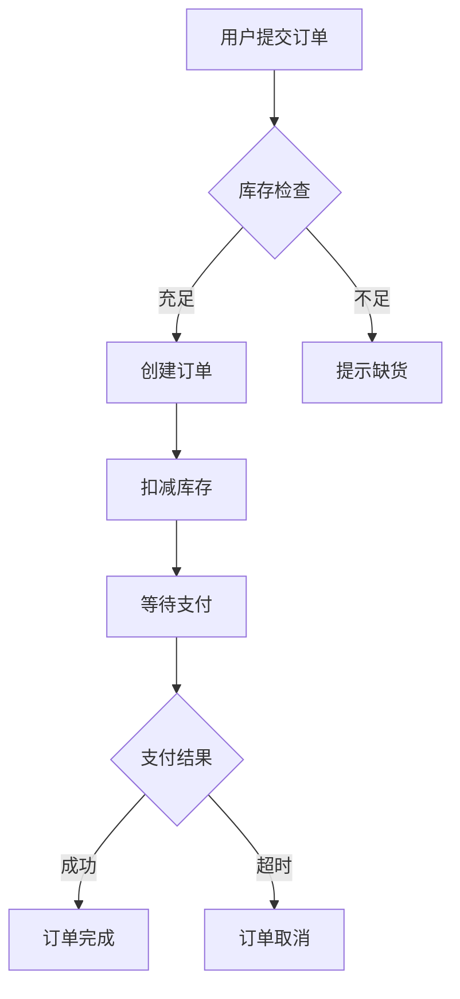
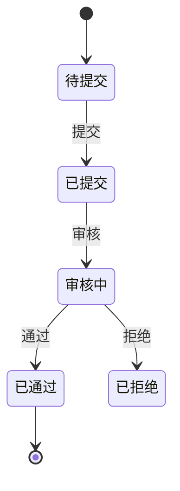
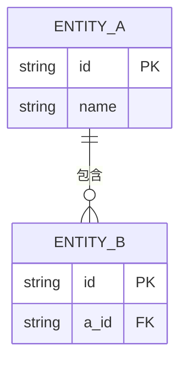

# PRD编写规范

PRD编写规范与格式指南。**模板见** `@prd-template.md`。

---

## 一、流程图规范

### 1.1 核心原则

**只画关键流程，不画"全局流程"**

PRD 中的业务流程图目的是让开发者和评审者快速理解核心业务逻辑，而非穷尽所有分支。一个 PRD 通常只需 2-5 个关键流程图：

| 流程类型 | 什么时候画 | 数量建议 |
|---------|-----------|---------|
| 核心业务流程 | 主线业务操作（下单、审批、发布等） | 2-3 个 |
| 状态流转图 | 实体有明显状态变化（订单状态、审核状态等） | 0-1 个 |
| 多角色协作流程 | 跨角色/跨系统协作 | 按需 |

**使用 Mermaid 语法输出所有流程图**，确保可直接渲染。

### 1.2 图表类型选择

| 类型 | Mermaid 语法 | 场景 |
|------|-------------|------|
| 业务流程图 | `flowchart TD` | 单角色操作流程、业务逻辑 |
| 泳道图 | `flowchart TD` + 子图 | 多角色协作流程 |
| 状态图 | `stateDiagram-v2` | 状态流转、生命周期 |
| 时序图 | `sequenceDiagram` | 系统交互、接口调用（可选） |

### 1.3 流程图示例

**业务流程图（flowchart）**：



**状态流转图（stateDiagram）**：



### 1.4 质量要求

- 流程起点终点明确
- 分支条件清晰（用 `{菱形}` 表示判断）
- 包含主要异常分支（不必穷尽）
- 节点命名使用业务语言（用户能看懂）

---

## 二、功能架构规范

### 2.1 功能复杂度分类

**复杂度决定描述详细程度，而非优先级**：

| 复杂度 | 定义 | 描述方式 |
|--------|------|----------|
| **简单** | 单一步骤，无分支逻辑 | 一句话描述 |
| **标准** | 3-5 步骤，有标准校验规则 | 引用模板 + 差异标注 |
| **复杂** | ≥5 步骤，有复杂业务规则/状态流转/多角色协作 | 完整描述 |

**判断流程**：
```
1. 判断是否为通用功能（查看/搜索/新增/编辑/删除/导出）？
   ├── 是 → 默认为标准复杂度
   │   ├── 无特殊业务规则 → 简单（一句话）
   │   └── 有特殊业务规则 → 标准（引用模板）
   └── 否 → 业务特定功能
       ├── 步骤 ≤ 3 且无分支 → 简单
       ├── 步骤 3-5 且有标准校验 → 标准
       └── 步骤 ≥ 5 或有复杂规则 → 复杂
```

---

### 2.1.1 功能类型分类

| 类型 | 定义 | 通用模板可用 | 示例 |
|------|------|--------------|------|
| **通用功能** | 标准化 CRUD 操作，跨模块复用 | ✓ 可引用 | 查看、搜索、新增、编辑、删除、导出 |
| **业务特定** | 特定业务逻辑，仅本模块使用 | ✗ 不可引用 | 审批流程、状态流转、批量操作 |

**通用功能判断**：
```
是否属于以下 6 类？
- 查看（列表显示、分页）
- 搜索（关键词、筛选条件）
- 新增（表单提交）
- 编辑（表单修改）
- 删除（确认删除）
- 导出（文件下载）
├── 是 → 通用功能，可引用模板
└── 否 → 业务特定，需完整描述
```

---

### 2.1.2 P0/P1/P2 优先级定义

**优先级与描述详细程度独立**：

| 优先级 | 定义 | 占比约束 | 描述要求 |
|--------|------|----------|----------|
| **P0** | MVP 核心功能，无则产品不可用 | ≤ 60% | **必须详细描述**（按复杂度决定方式） |
| **P1** | 重要功能，提升核心体验 | ~20% | **必须详细描述**（按复杂度决定方式） |
| **P2** | 增强功能，资源允许时实现 | ≥ 20% | 可简要说明或引用模板 |

**优先级判断规则**：
```
P0（Must have）判断：
1. 没有这个功能，产品还能正常工作吗？→ 不能 = P0
2. 这是核心业务流程必需的吗？→ 是 = P0
3. 用户会因为这个功能缺失而投诉吗？→ 会 = P0

P1（Should have）判断：
1. 功能缺失会影响用户体验吗？→ 会 = P1
2. 有替代方案但体验较差？→ 是 = P1

P2（Could have）判断：
1. 功能增加可提升体验但非必需？→ 是 = P2
2. 资源允许时实现？→ 是 = P2
```

**分布验证**：
- P0 ≤ 60%（避免全是核心功能）
- P1 + P2 ≥ 30%（必须有增强功能）

---

### 2.1.3 通用模板引用规范

**引用 `@总览PRD#五、共享通用功能模板库` 减少重复内容**：

> **⚠️ 引用必须标注来源**：开发人员阅读的是PRD文档，引用格式必须为 `@总览PRD#5.X [模板ID] [模板名称]`，以便开发人员找到完整模板。

| 复杂度 | 功能类型 | 引用方式 | 示例 |
|--------|----------|----------|------|
| 简单 | 通用 | **一句话引用** | `查看列表，按默认排序显示` |
| 标准 | 通用 | **模板ID + 差异标注** | `T01 查看 + 字段差异` |
| 复杂 | 通用 | **模板ID + 补充规则** | `T03 新增 + 复杂校验规则` |
| 标准 | 业务特定 | **完整描述**（使用模板结构） | 审批流程完整描述 |
| 复杂 | 业务特定 | **完整描述 + 详细规则** | 状态流转 + 规则表 |

**引用格式**（正确格式）：
```markdown
#### F01 [功能名称]

**模板引用**: @总览PRD#5.X [模板ID] [模板名称]

**差异标注**:
- [差异项]: [差异内容]
- [差异项]: [差异内容]

**补充业务规则**:
- [BR编号]: [规则描述]
```

> **注意**：禁止仅写模板ID（如"T01查看列表模板"）而不标注来源，开发人员无法在PRD中找到模板。

---

### 2.1 功能层级定义

**三级功能架构**：

| 层级 | 名称 | 说明 | 示例 |
|------|------|------|------|
| **一级** | 模块 | 业务领域划分 | 商品管理、订单管理 |
| **二级** | 功能 | 业务功能单元（对应菜单项） | 商品列表、商品分类 |
| **三级** | 功能点 | 具体操作（CRUD） | 新增商品、编辑商品、删除商品、查看商品 |

**功能点粒度规则**：
- 每个二级功能按 CRUD 操作拆分为三级功能点
- 常见功能点：查看列表、搜索、新增、编辑、删除、批量操作
- 简单功能（如查看列表）可合并为一个功能点
- 复杂功能（如审批流程）可拆分为多个功能点

### 2.2 功能清单格式

**⚠️ 硬约束：表格格式验证**

**一级合并、二级合并、三级按行展示规则**：

| 列名 | 合并规则 | 正确示例 | 错误示例 |
|------|----------|----------|----------|
| 一级模块 | **第一行填写完整名称，后续行留空** | `M01 商品管理`（第1行）<br>``（第2-10行） | 每行都写`M01 商品管理` |
| 二级功能 | **第一行填写完整名称，后续行留空** | `F01 商品列表`（第1行）<br>``（第2-5行） | 每行都写`F01 商品列表` |
| 三级功能点 | **每行独立填写，不合并** | 每行都写完整功能点ID和名称 | 留空或合并 |

**验证方式**：
```
检查输出表格：
1. 一级模块列：同一模块的所有行，只有第1行有值，其余为空 → ✓
2. 二级功能列：同一功能的所有行，只有第1行有值，其余为空 → ✓
3. 三级功能点列：每行都有完整ID和名称 → ✓

违规示例（必须避免）：
| M01 商品管理 | F01 商品列表 | F0101 查看列表 |
| M01 商品管理 | F01 商品列表 | F0102 搜索     |  ← 一级/二级重复填写（错误）
```

**统一功能清单表**（一级合并、二级合并、三级按行展示）：

> 使用空白单元格模拟合并效果，同一级模块的第一行填写模块名，后续行为空；同一二级功能的第一行填写功能名，后续行为空。

| 一级模块 | 二级功能 | 三级功能点 | 优先级 | 页面/组件 | 用户角色 | 对应业务活动 | 前置依赖 |
|----------|----------|------------|--------|-----------|----------|--------------|----------|
| M01 商品管理 | F01 商品列表 | F0101 查看列表 | P0 | P001 列表页 | 管理员 | A01 商品查询 | — |
| | | F0102 搜索 | P0 | P001 搜索区 | 管理员 | A01 商品查询 | — |
| | | F0103 新增 | P0 | P002 表单弹窗 | 管理员 | A02 商品上架 | F0201（分类管理） |
| | | F0104 编辑 | P0 | P002 表单弹窗 | 管理员 | A03 商品修改 | — |
| | | F0105 删除 | P1 | 确认弹窗 | 管理员 | A04 商品下架 | — |
| | F02 商品分类 | F0201 查看分类树 | P0 | P003 分类树页 | 管理员 | A05 分类管理 | — |
| | | F0202 新增分类 | P0 | P004 分类表单 | 管理员 | A05 分类管理 | — |

**前置依赖列填写规则**：
- 填写被依赖的功能点 ID，多个用 `/` 分隔（如 `F0201/F0202`）
- 若无依赖填 `—`
- 外部系统依赖用文字描述，如"支付接口联调完成"

**格式规则**：
- 一级模块：只在该模块的第一行填写，后续行留空（视觉合并）
- 二级功能：只在该功能的第一行填写，后续行留空（视觉合并）
- 三级功能点：每行独立填写，不合并
- 优先级：P0/P1/P2
- 页面/组件：标注对应的页面编号或组件名称
- 用户角色：列出有权限的角色，多个角色用 `/` 分隔
- **对应业务活动**：标注该功能点支撑的业务活动ID，实现业务↔功能双向追溯
- **前置依赖**：标注依赖的功能点ID或外部依赖，帮助开发判断并行/串行开发路径

### 2.3 菜单层级结构

```
系统名称
├── 模块一（一级）
│   ├── 功能1.1 (F01)（二级菜单项）
│   │   ├── 查看列表 (F0101)
│   │   ├── 搜索 (F0102)
│   │   ├── 新增 (F0103)
│   │   └── 编辑 (F0104)
│   └── 功能1.2 (F02)
└── 模块二（一级）
    └── 功能2.1 (F03)（二级菜单项）
```

**注意**：三级功能点不体现在菜单中，而是通过页面内的按钮、组件来实现。

### 2.4 编号规则

| 编号类型 | 格式 | 说明 | 示例 |
|----------|------|------|------|
| **模块编号** | M01-M99 | 一级模块编号 | M01 商品管理 |
| **二级功能编号** | F01-F99 | 二级功能编号（全局唯一） | F01 商品列表 |
| **三级功能点编号** | F0101-F0199 | 二级功能 + 功能点序号 | F0101 查看商品列表 |

### 2.5 功能详细描述模板

**⚠️ 硬约束：P0/P1功能描述完整性**

**8项必填检查表**：

| 必填项 | 内容要求 | P0 | P1 | P2 | 验证方式 |
|--------|----------|----|----|----|----|
| 1. 功能描述 | 一句话说明功能做什么、解决什么问题 | ✓ 必填 | ✓ 必填 | 可简述 | 输出内容是否包含 |
| 2. 功能点清单 | 三级功能点ID、名称、页面、优先级、业务活动 | ✓ 必填 | ✓ 必填 | 可省略 | 表格是否完整 |
| 3. 前置条件 | 用户已登录、数据已存在、依赖功能已完成等 | ✓ 必填 | ✓ 必填 | 可省略 | 是否列出前置条件 |
| 4. 权限矩阵 | 各角色对各操作的权限（✓/✗/仅本人） | ✓ 必填 | ✓ 必填 | 可省略 | 表格是否完整 |
| 5. 触发位置 | 页面编号、组件名称、按钮位置 | ✓ 必填 | ✓ 必填 | 可省略 | 是否标注具体位置 |
| 6. 交互流程 | 步骤编号、用户操作、系统响应 | ✓ 必填 | ✓ 必填 | 可省略 | 步骤是否完整 |
| 7. 字段约束 | 字段名、类型、必填、约束规则、错误提示文案、校验层级 | ✓ 必填 | ✓ 必填 | 可省略 | 表格是否完整（6列） |
| 8. 验收标准 | Given-When-Then格式，覆盖主流程+异常 | ✓ 必填 | ✓ 必填 | 可省略 | 是否覆盖主流程 |
| 9. 设计决策 | 备选方案、选择原因、接受的权衡（仅复杂功能） | ✓ P0复杂必填 | 建议填写 | 可省略 | 复杂功能是否有设计决策 |

**违规判定**：
```
P0/P1功能描述检查：
- 缺失任意1-8项 → 违规，必须补充
- 仅有模板引用无实际内容 → 违规，必须填写差异标注
- 前置条件写"无"而非列出具体条件 → 违规，必须补充

P2功能描述：
- 可引用模板 + 简要差异标注
- 不强制展开8项
```

**描述范围**：P0 和 P1 优先级的二级功能必须展开详细描述，P2 可简要说明。

**二级功能描述模板**（P0/P1 必填）：

```markdown
#### F01 [二级功能名称]

**功能描述**
[一句话说清楚这个功能做什么、解决什么问题]

**功能点清单**
| 功能点ID | 功能点名称 | 页面/组件 | 优先级 | 对应业务活动 |
|----------|------------|-----------|--------|--------------|
| F0101 | 查看列表 | P001 列表页 | P0 | A01 商品查询 |
| F0102 | 搜索筛选 | P001 搜索区 | P0 | A01 商品查询 |
| F0103 | 新增 | P002 表单弹窗 | P0 | A02 商品上架 |
| F0104 | 编辑 | P002 表单弹窗 | P0 | A03 商品修改 |
| F0105 | 删除 | 确认弹窗 | P1 | A04 商品下架 |

**前置条件**
- [用户已登录 / 数据已存在 / 依赖功能 FXX 已完成]

**权限矩阵**
| 操作 | 管理员 | 普通用户 | 访客 |
|------|--------|----------|------|
| 查看 | ✓ | ✓ | ✗ |
| 新建 | ✓ | ✓ | ✗ |
| 编辑 | ✓ | 仅本人 | ✗ |
| 删除 | ✓ | ✗ | ✗ |
```

**三级功能点详细描述模板**（P0/P1 功能点必须展开）：

```markdown
#### F0103 新增商品

**功能描述**
点击新增按钮 → 打开表单弹窗 → 填写商品信息 → 提交保存

**触发位置**
- 页面：P001 商品列表页
- 组件：toolbarActions 新增按钮

**交互流程**
1. 点击"新增"按钮 → 打开 P002 表单弹窗
2. 填写字段（名称、分类、价格、库存、状态）
3. 点击"确定" → 校验 → 保存 → 关闭弹窗 → 刷新列表

**字段约束**
| 字段名 | 类型 | 必填 | 约束规则 | 错误提示文案 | 校验层级 |
|--------|------|------|----------|-------------|----------|
| 名称 | 文本 | 是 | 长度 1-50 字符，不可重复 | "请输入名称"（空） / "名称已存在"（重复） | 前端（空） + 后端（重复） |

**业务规则**
- BR01: 名称不可与现有商品重复
- BR02: 价格为 0 时需提示确认

> 详细规范见 `@business-modeling.md#业务规则体系`

**验收标准**
- Given 用户已登录且有新增权限 When 点击新增按钮 Then 打开表单弹窗
- Given 表单填写完成 When 点击确定 Then 校验通过后保存数据
```

**设计决策**（仅复杂功能，P0 必填，P1 建议填写）

> 记录 WHY（为什么这么设计），帮助开发理解设计意图，便于后续迭代判断原始约束是否还成立。

```markdown
**设计决策**

- 备选方案：A. 实时搜索（输入即搜索）B. 点击按钮搜索
- 选择方案：B（点击搜索）
- 选择原因：数据量大时实时搜索对后端压力过大；B 端用户习惯点击确认
- 接受的权衡：用户需要多一次点击操作，但可接受
- 约束条件：若后续引入 ElasticSearch，可评估改为实时搜索
```

---

## 三、业务实体模型规范

### 3.1 实体定义格式

| 实体ID | 实体名称 | 英文名称 | 业务含义 | 数据来源 |
|--------|----------|----------|----------|----------|

### 3.2 属性定义格式

| 序号 | 字段中文名 | 字段英文名 | 类型 | 必填 | 说明 |
|------|------------|------------|------|------|------|

### 3.3 ER图示例



---

## 四、页面线框图规范

### 4.1 线框图原则

**本质：表达布局结构和交互流程，不涉及 UI 视觉**

| 特性 | 规范 |
|------|------|
| 边框 | 灰色（#999），1-2px |
| 填充 | 浅灰（#eee / #f5f5f5 / #ddd） |
| 文字 | 占位文字，灰色（#999/#666） |
| 颜色 | 不使用真实颜色，只用灰色系 |
| 图标 | 不使用图标，用文字表示 |
| 组件标注 | 每个区域标注组件类型 |

### 4.2 页面类型

| 页面类型 | 内容结构 | 适用场景 |
|---------|---------|---------|
| **list** | 搜索区 → 操作栏 → 表格 → 分页 | 数据管理 |
| **form-modal** | 标题 → 表单字段 → 操作按钮 | 新增/编辑 |
| **detail** | 信息区 → 关联区 → 操作按钮 | 查看 |
| **dashboard** | 筛选 → 卡片 → 图表 | 统计报表 |

### 4.3 输出格式

| 输出 | 文件 | 用途 |
|------|------|------|
| HTML 线框图 | `wireframes-[模块名]-v[版本].html` | 人 review |
| YAML 页面规格 | 嵌入 PRD 章节 | 前端代码生成 |

完整模板见 `@wireframe-layout-templates.md`，生成流程见 `@workflows/wireframe-generation.md`。

---

## 五、用户故事与验收标准

### 5.1 用户故事格式

```
作为 [用户角色]
我想要 [完成目标]
以便于 [获得价值]
```

### 5.2 验收标准格式

**⚠️ 硬约束：P0/P1 功能验收标准必须覆盖四类场景**

开发和测试面对的 80% 问题集中在边界值和异常场景，验收标准必须完整覆盖：

| 场景类型 | 覆盖目的 | 必填性 |
|----------|----------|--------|
| **正向用例** | 主流程成功路径 | P0/P1 必填 |
| **边界值** | 字段极限值、数量上限 | P0/P1 必填 |
| **负向用例** | 校验失败、业务规则违反 | P0/P1 必填 |
| **权限异常** | 无权限时的系统行为 | P0/P1 必填 |

**四象限测试矩阵格式**：

```markdown
**验收标准**

| 场景类型 | Given | When | Then |
|----------|-------|------|------|
| 正向用例 | 用户已登录且有新增权限 | 填写完整表单点击确定 | 数据保存成功，列表刷新，Toast 提示"新增成功" |
| 边界值 | 名称字段输入 50 个字符（最大值） | 点击确定 | 校验通过，正常保存 |
| 负向用例 | 名称字段为空 | 点击确定 | 名称输入框下方显示"请输入名称"，表单不提交 |
| 权限异常 | 用户无新增权限 | 进入列表页 | "新增"按钮不渲染（不是置灰，而是不显示） |
```

**格式说明**：
- 每类场景至少 1 条验收标准
- 使用表格形式，便于开发/测试直接使用
- `Then` 需描述具体的系统行为（提示文案、按钮状态等）

### 5.3 INVEST原则

| 原则 | 说明 |
|------|------|
| Independent | 独立可交付 |
| Negotiable | 可协商 |
| Valuable | 有价值 |
| Estimable | 可估算 |
| Small | 足够小 |
| Testable | 可测试 |

---

## 六、非功能需求量化规范

非功能需求最常见的问题是写成"系统响应要快"等无法测试的描述。本节提供 B端 SaaS 场景的**默认基准值**。

### 6.1 性能要求

| 指标 | B端 SaaS 默认基准 | 说明 |
|------|-------------------|------|
| 页面首屏加载 | ≤ 2s（正常网络） | 超出需注明原因 |
| 接口响应时间 | ≤ 500ms（P95） | 报表/导出类接口可放宽至 3s |
| 并发用户数 | ≥ 100 并发（单租户） | 大客户项目需单独评估 |
| 数据列表分页 | 默认每页 20 条，最大 100 条 | |
| 批量操作上限 | 单次 ≤ 500 条 | 超出提示分批处理 |

### 6.2 安全要求

| 安全域 | 要求 | 等级 |
|--------|------|------|
| 身份认证 | JWT + 有效期 ≤ 2h，支持强制下线 | P0 |
| 权限控制 | RBAC，接口级鉴权 | P0 |
| 数据隔离 | 多租户数据严格隔离 | P0 |
| 操作日志 | 关键操作需记录操作人+时间 | P1 |
| SQL注入 | 所有输入参数化处理 | P0 |

### 6.3 可用性要求

| 指标 | 默认基准 | 高可用场景 |
|------|----------|------------|
| 系统可用性 | ≥ 99.5%（月度） | 核心链路 ≥ 99.9% |
| 故障恢复目标（RTO） | ≤ 4h | 核心功能 ≤ 1h |
| 数据恢复目标（RPO） | ≤ 24h | 核心数据 ≤ 1h |
| 浏览器兼容 | Chrome 90+，Edge 90+，Safari 14+ | |

---

## 七、文档质量标准

| 检查项 | 要求 |
|--------|------|
| 完整性 | 必需章节完整 |
| 清晰度 | 无歧义描述 |
| 可测试性 | 有明确验收标准 |
| 一致性 | 术语使用一致 |