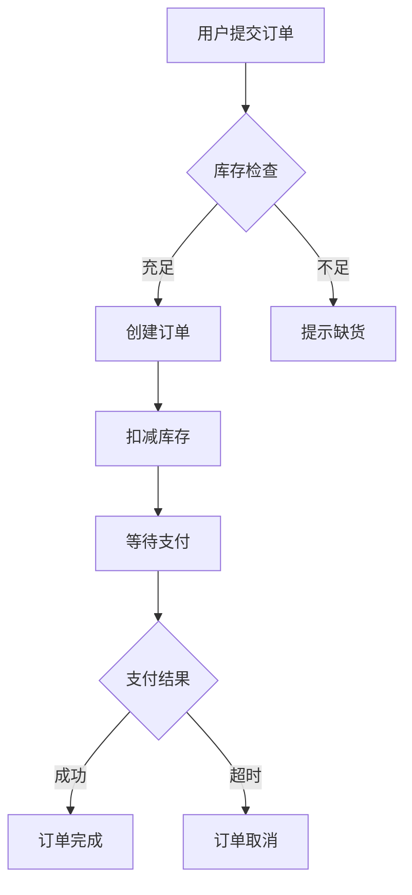
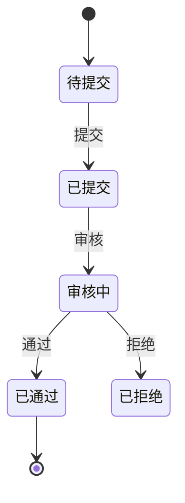
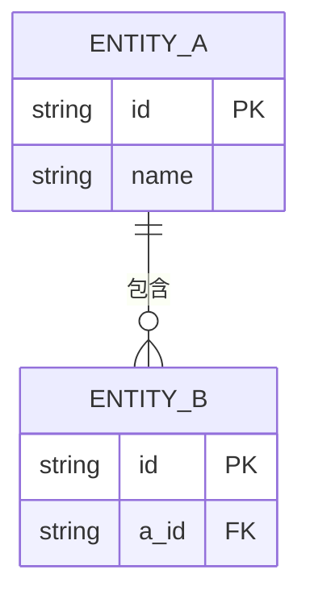

# PRD编写规范

PRD编写规范与格式指南。**模板见** `@prd-template.md`。

---

## 一、流程图规范

### 1.1 核心原则

**只画关键流程，不画"全局流程"**

PRD 中的业务流程图目的是让开发者和评审者快速理解核心业务逻辑，而非穷尽所有分支。一个 PRD 通常只需 2-5 个关键流程图：

| 流程类型 | 什么时候画 | 数量建议 |
|---------|-----------|---------|
| 核心业务流程 | 主线业务操作（下单、审批、发布等） | 2-3 个 |
| 状态流转图 | 实体有明显状态变化（订单状态、审核状态等） | 0-1 个 |
| 多角色协作流程 | 跨角色/跨系统协作 | 按需 |

**使用 Mermaid 语法输出所有流程图**，确保可直接渲染。

### 1.2 图表类型选择

| 类型 | Mermaid 语法 | 场景 |
|------|-------------|------|
| 业务流程图 | `flowchart TD` | 单角色操作流程、业务逻辑 |
| 泳道图 | `flowchart TD` + 子图 | 多角色协作流程 |
| 状态图 | `stateDiagram-v2` | 状态流转、生命周期 |
| 时序图 | `sequenceDiagram` | 系统交互、接口调用（可选） |

### 1.3 流程图示例

**业务流程图（flowchart）**：



**状态流转图（stateDiagram）**：



### 1.4 质量要求

- 流程起点终点明确
- 分支条件清晰（用 `{菱形}` 表示判断）
- 包含主要异常分支（不必穷尽）
- 节点命名使用业务语言（用户能看懂）

---

## 二、功能架构规范

### 2.1 功能层级定义

**三级功能架构**：

| 层级 | 名称 | 说明 | 示例 |
|------|------|------|------|
| **一级** | 模块 | 业务领域划分 | 商品管理、订单管理 |
| **二级** | 功能 | 业务功能单元（对应菜单项） | 商品列表、商品分类 |
| **三级** | 功能点 | 具体操作（CRUD） | 新增商品、编辑商品、删除商品、查看商品 |

**功能点粒度规则**：
- 每个二级功能按 CRUD 操作拆分为三级功能点
- 常见功能点：查看列表、搜索、新增、编辑、删除、批量操作
- 简单功能（如查看列表）可合并为一个功能点
- 复杂功能（如审批流程）可拆分为多个功能点

### 2.2 功能清单格式

**二级功能清单**（概览）：

| 功能ID | 功能名称 | 优先级 | 模块 | 描述 | 用户角色 |
|--------|----------|--------|------|------|----------|
| F01 | [二级功能名] | P0 | [模块] | [描述] | [角色] |

**三级功能点清单**（展开）：

| 功能点ID | 功能点名称 | 优先级 | 所属功能 | 页面/组件 | 用户角色 |
|----------|------------|--------|----------|-----------|----------|
| F0101 | 查看商品列表 | P0 | F01 商品列表 | P001 列表页 | 管理员/普通用户 |
| F0102 | 搜索商品 | P0 | F01 商品列表 | P001 搜索区 | 管理员/普通用户 |
| F0103 | 新增商品 | P0 | F01 商品列表 | P002 表单弹窗 | 管理员 |
| F0104 | 编辑商品 | P0 | F01 商品列表 | P002 表单弹窗 | 管理员 |
| F0105 | 删除商品 | P1 | F01 商品列表 | 确认弹窗 | 管理员 |

### 2.3 菜单层级结构

```
系统名称
├── 模块一（一级）
│   ├── 功能1.1 (F01)（二级菜单项）
│   │   ├── 查看列表 (F0101)
│   │   ├── 搜索 (F0102)
│   │   ├── 新增 (F0103)
│   │   └── 编辑 (F0104)
│   └── 功能1.2 (F02)
└── 模块二（一级）
    └── 功能2.1 (F03)（二级菜单项）
```

**注意**：三级功能点不体现在菜单中，而是通过页面内的按钮、组件来实现。

### 2.4 编号规则

| 编号类型 | 格式 | 说明 | 示例 |
|----------|------|------|------|
| **模块编号** | M01-M99 | 一级模块编号 | M01 商品管理 |
| **二级功能编号** | F01-F99 | 二级功能编号（全局唯一） | F01 商品列表 |
| **三级功能点编号** | F0101-F0199 | 二级功能 + 功能点序号 | F0101 查看商品列表 |

### 2.5 功能详细描述模板

**二级功能描述模板**：

```markdown
#### F01 [二级功能名称]

**功能描述**
[一句话说清楚这个功能做什么、解决什么问题]

**功能点清单**
| 功能点ID | 功能点名称 | 页面/组件 | 优先级 |
|----------|------------|-----------|--------|
| F0101 | 查看列表 | P001 列表页 | P0 |
| F0102 | 搜索筛选 | P001 搜索区 | P0 |
| F0103 | 新增 | P002 表单弹窗 | P0 |

**前置条件**
- [用户已登录 / 数据已存在 / 依赖功能 FXX 已完成]

**权限矩阵**
| 操作 | 管理员 | 普通用户 | 访客 |
|------|--------|----------|------|
| 查看 | ✓ | ✓ | ✗ |
| 新建 | ✓ | ✓ | ✗ |
| 编辑 | ✓ | 仅本人 | ✗ |
```

**三级功能点详细描述模板**（复杂功能点展开）：

```markdown
#### F0103 新增商品

**功能描述**
点击新增按钮 → 打开表单弹窗 → 填写商品信息 → 提交保存

**触发位置**
- 页面：P001 商品列表页
- 组件：toolbarActions 新增按钮

**交互流程**
1. 点击"新增"按钮 → 打开 P002 表单弹窗
2. 填写字段（名称、分类、价格、库存、状态）
3. 点击"确定" → 校验 → 保存 → 关闭弹窗 → 刷新列表

**字段约束**
| 字段名 | 类型 | 必填 | 约束规则 |
|--------|------|------|----------|
| 名称 | 文本 | 是 | 长度 1-50 字符，不可重复 |

**业务规则**
- BR01: 名称不可与现有商品重复
- BR02: 价格为 0 时需提示确认

> 详细规范见 `@business-modeling.md#业务规则体系`

**验收标准**
- Given 用户已登录且有新增权限 When 点击新增按钮 Then 打开表单弹窗
- Given 表单填写完成 When 点击确定 Then 校验通过后保存数据
```

---

## 三、业务实体模型规范

### 3.1 实体定义格式

| 实体ID | 实体名称 | 英文名称 | 业务含义 | 数据来源 |
|--------|----------|----------|----------|----------|

### 3.2 属性定义格式

| 序号 | 字段中文名 | 字段英文名 | 类型 | 必填 | 说明 |
|------|------------|------------|------|------|------|

### 3.3 ER图示例



---

## 四、页面线框图规范

### 4.1 线框图原则

**本质：表达布局结构和交互流程，不涉及 UI 视觉**

| 特性 | 规范 |
|------|------|
| 边框 | 灰色（#999），1-2px |
| 填充 | 浅灰（#eee / #f5f5f5 / #ddd） |
| 文字 | 占位文字，灰色（#999/#666） |
| 颜色 | 不使用真实颜色，只用灰色系 |
| 图标 | 不使用图标，用文字表示 |
| 组件标注 | 每个区域标注组件类型 |

### 4.2 页面类型

| 页面类型 | 内容结构 | 适用场景 |
|---------|---------|---------|
| **list** | 搜索区 → 操作栏 → 表格 → 分页 | 数据管理 |
| **form-modal** | 标题 → 表单字段 → 操作按钮 | 新增/编辑 |
| **detail** | 信息区 → 关联区 → 操作按钮 | 查看 |
| **dashboard** | 篮选 → 卡片 → 图表 | 统计报表 |

### 4.3 输出格式

| 输出 | 文件 | 用途 |
|------|------|------|
| HTML 线框图 | `wireframes-[模块名]-v[版本].html` | 人 review |
| YAML 页面规格 | 嵌入 PRD 章节 | 前端代码生成 |

完整模板见 `@wireframe-layout-templates.md`，生成流程见 `@workflows/wireframe-generation.md`。

---

## 五、用户故事与验收标准

### 5.1 用户故事格式

```
作为 [用户角色]
我想要 [完成目标]
以便于 [获得价值]
```

### 5.2 验收标准格式

```
Given [前置条件]
When [用户操作]
Then [预期结果]
```

### 5.3 INVEST原则

| 原则 | 说明 |
|------|------|
| Independent | 独立可交付 |
| Negotiable | 可协商 |
| Valuable | 有价值 |
| Estimable | 可估算 |
| Small | 足够小 |
| Testable | 可测试 |

---

## 六、非功能需求量化规范

非功能需求最常见的问题是写成"系统响应要快"等无法测试的描述。本节提供 B端 SaaS 场景的**默认基准值**。

### 6.1 性能要求

| 指标 | B端 SaaS 默认基准 | 说明 |
|------|-------------------|------|
| 页面首屏加载 | ≤ 2s（正常网络） | 超出需注明原因 |
| 接口响应时间 | ≤ 500ms（P95） | 报表/导出类接口可放宽至 3s |
| 并发用户数 | ≥ 100 并发（单租户） | 大客户项目需单独评估 |
| 数据列表分页 | 默认每页 20 条，最大 100 条 | |
| 批量操作上限 | 单次 ≤ 500 条 | 超出提示分批处理 |

### 6.2 安全要求

| 安全域 | 要求 | 等级 |
|--------|------|------|
| 身份认证 | JWT + 有效期 ≤ 2h，支持强制下线 | P0 |
| 权限控制 | RBAC，接口级鉴权 | P0 |
| 数据隔离 | 多租户数据严格隔离 | P0 |
| 操作日志 | 关键操作需记录操作人+时间 | P1 |
| SQL注入 | 所有输入参数化处理 | P0 |

### 6.3 可用性要求

| 指标 | 默认基准 | 高可用场景 |
|------|----------|------------|
| 系统可用性 | ≥ 99.5%（月度） | 核心链路 ≥ 99.9% |
| 故障恢复目标（RTO） | ≤ 4h | 核心功能 ≤ 1h |
| 数据恢复目标（RPO） | ≤ 24h | 核心数据 ≤ 1h |
| 浏览器兼容 | Chrome 90+，Edge 90+，Safari 14+ | |

---

## 七、文档质量标准

| 检查项 | 要求 |
|--------|------|
| 完整性 | 必需章节完整 |
| 清晰度 | 无歧义描述 |
| 可测试性 | 有明确验收标准 |
| 一致性 | 术语使用一致 |

---

## 版本

- v4.0
- 更新: 2026-04-12
- 重构: 从模板拆分，精简为规范文档
- 引用: 模板见 `@prd-template.md`