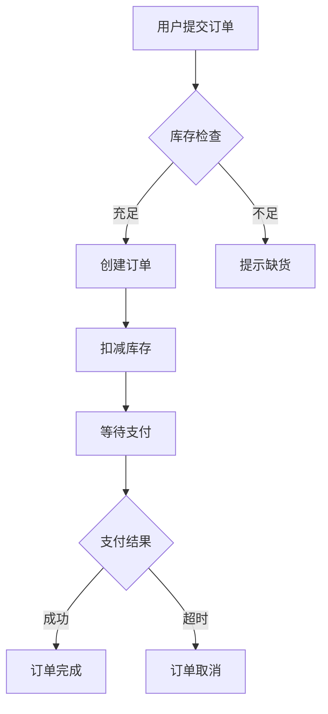
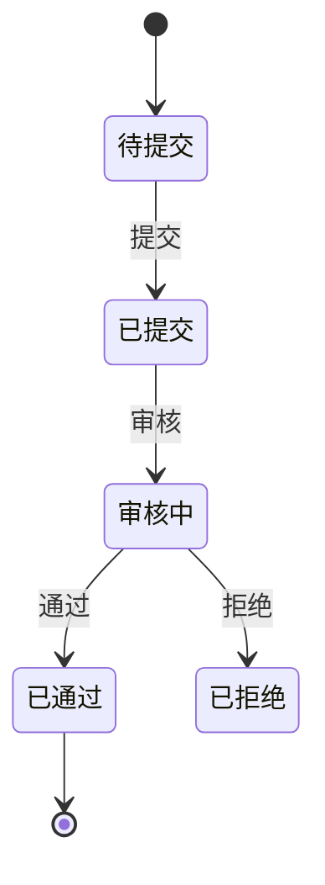
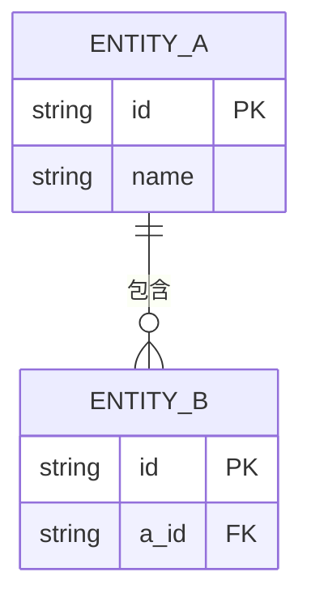

# PRD编写规范

PRD模板与编写指南。详细流程见 `workflows/prd-writing.md`。

---

## 一、PRD模板

```markdown
# 产品需求文档 (PRD)

| 文档版本 | 1.0 |
|---------|-----|
| 编写日期 | YYYY-MM-DD |
| 文档状态 | 草稿/评审中/已确认 |

## 修订记录
| 版本 | 日期 | 修订人 | 修订内容 |
|------|------|--------|----------|
| 1.0 | YYYY-MM-DD | 姓名 | 初始版本 |

## 一、执行摘要
### 1.1 产品愿景
### 1.2 问题陈述
### 1.3 解决方案概述
### 1.4 目标用户

## 二、成功标准
### 2.1 业务指标
| 指标 | 当前值 | 目标值 | 测量方法 |
|------|--------|--------|----------|

## 三、产品范围
### 3.1 In Scope
### 3.2 Out of Scope
### 3.3 MVP定义

## 四、用户画像
### 4.1 主要用户画像
### 4.2 用户角色权限

## 五、功能架构
> 详见下方"功能清单规范"

### 5.1 功能清单
| 功能ID | 功能名称 | 优先级 | 模块 | 描述 | 用户角色 |
|--------|----------|--------|------|------|----------|

### 5.2 功能菜单层级结构

### 5.3 功能详细描述（P0/P1功能需展开）
> 使用下方"功能详细描述模板"

## 六、核心业务流程
> 使用 Mermaid 语法输出，详见下方"流程图规范"
> 只画 2-5 个关键业务流程，而非试图画"全局流程"

### 6.1 [流程名称1]（Mermaid flowchart）
### 6.2 [流程名称2]（Mermaid flowchart）
### 6.3 状态流转图（如需要，Mermaid stateDiagram）

## 七、用户旅程
### 7.1 核心用户流程
### 7.2 用户故事
### 7.3 异常流程

## 八、业务实体模型
> 详见下方"业务实体模型规范"

### 8.1 核心实体识别
### 8.2 实体属性定义
### 8.3 实体关系图（ER图，Mermaid erDiagram）

## 九、非功能需求
> 详见下方"非功能需求量化规范"

### 9.1 性能要求
### 9.2 安全要求
### 9.3 可用性要求

## 十、风险与依赖
## 十一、时间规划
## 十二、附录
```

---

## 二、流程图规范

### 2.1 核心原则

**只画关键流程，不画"全局流程"**

PRD 中的业务流程图目的是让开发者和评审者快速理解核心业务逻辑，而非穷尽所有分支。一个 PRD 通常只需 2-5 个关键流程图：

| 流程类型 | 什么时候画 | 数量建议 |
|---------|-----------|---------|
| 核心业务流程 | 主线业务操作（下单、审批、发布等） | 2-3 个 |
| 状态流转图 | 实体有明显状态变化（订单状态、审核状态等） | 0-1 个 |
| 多角色协作流程 | 跨角色/跨系统协作 | 按需 |

**使用 Mermaid 语法输出所有流程图**，确保可直接渲染。

### 2.2 图表类型选择

| 类型 | Mermaid 语法 | 场景 |
|------|-------------|------|
| 业务流程图 | `flowchart TD` | 单角色操作流程、业务逻辑 |
| 泳道图 | `flowchart TD` + 子图 | 多角色协作流程 |
| 状态图 | `stateDiagram-v2` | 状态流转、生命周期 |
| 时序图 | `sequenceDiagram` | 系统交互、接口调用（可选） |

### 2.3 流程图示例

**业务流程图（flowchart）**：



**状态流转图（stateDiagram）**：



### 2.4 质量要求

- 流程起点终点明确
- 分支条件清晰（用 `{菱形}` 表示判断）
- 包含主要异常分支（不必穷尽）
- 节点命名使用业务语言（用户能看懂）

---

## 三、功能架构规范

### 3.1 功能清单格式

| 功能ID | 功能名称 | 优先级 | 模块 | 描述 | 用户角色 |
|--------|----------|--------|------|------|----------|
| F001 | [功能名] | P0 | [模块] | [描述] | [角色] |

### 3.2 菜单层级结构

```
系统名称
├── 模块一
│   ├── 功能1.1 (F001)
│   └── 功能1.2 (F002)
└── 模块二
    └── 功能2.1 (F003)
```

### 3.3 编号规则

- 模块编号: 01-99
- 功能编号: F0101（模块01第01个功能）

### 3.4 功能详细描述模板

每个 P0/P1 功能建议用以下模板展开，让开发者看完就知道"边界在哪、规则是什么、谁能用"，避免联调时靠口头对齐。

```markdown
#### F0101 [功能名称]

**功能描述**
[一句话说清楚这个功能做什么、解决什么问题]

**前置条件**
- [用户已登录 / 数据已存在 / 依赖功能 FXX 已完成]

**权限矩阵**
| 操作 | 管理员 | 普通用户 | 访客 |
|------|--------|----------|------|
| 查看 | ✓ | ✓ | ✗ |
| 新建 | ✓ | ✓ | ✗ |
| 编辑 | ✓ | 仅本人 | ✗ |
| 删除 | ✓ | ✗ | ✗ |

**字段约束**
| 字段名 | 类型 | 必填 | 约束规则 |
|--------|------|------|----------|
| 名称 | 文本 | 是 | 长度 1-50 字符，不可重复 |
| 金额 | 数字 | 是 | 精度 2 位小数，≥ 0 |
| 状态 | 枚举 | 是 | 草稿 / 提交中 / 已完成 |
| 备注 | 文本 | 否 | 最长 500 字符 |

**业务规则**
- BR01: [规则描述，明确触发条件和结果]
- BR02: [例：状态为"已完成"后不允许编辑]

**异常处理**
| 异常场景 | 提示文案 | 处理方式 |
|----------|----------|----------|
| 名称重复 | "名称已存在，请修改后重试" | 阻止提交，高亮字段 |
| 无操作权限 | "您没有权限执行此操作" | 按钮置灰或隐藏 |
| 数据不存在 | "内容已被删除" | 跳转列表页 |

**验收标准**
- Given [前置条件] When [操作] Then [预期结果]
```

> 并非每个功能都要填满所有项。简单 CRUD 功能只需填字段约束和验收标准；涉及多角色、复杂规则的功能才需要完整填写。

---

## 四、业务实体模型规范

### 4.1 实体定义格式

| 实体ID | 实体名称 | 英文名称 | 业务含义 | 数据来源 |
|--------|----------|----------|----------|----------|

### 4.2 属性定义格式

| 序号 | 字段中文名 | 字段英文名 | 类型 | 必填 | 说明 |
|------|------------|------------|------|------|------|

### 4.3 ER图示例



---

## 五、页面线框图规范

### 5.1 线框图原则

**本质：表达布局结构和交互流程，不涉及 UI 视觉**

| 特性 | 规范 |
|------|------|
| 边框 | 灰色（#999），1-2px |
| 填充 | 浅灰（#eee / #f5f5f5 / #ddd） |
| 文字 | 占位文字（如 `[商品名称]`），灰色（#999/#666） |
| 颜色 | 不使用真实颜色，只用灰色系 |
| 图标 | 不使用图标，用文字表示（如 `+` `✕` `▼` `📅` `☐`） |
| 组件标注 | 每个区域标注组件类型（如 `组件：表格`） |
| 交互标注 | 用文字描述交互流程 |

**不需要 UI 设计 skill**：线框图只表达结构，不涉及颜色/字体等 UI 视觉细节。

### 5.2 统一布局

**所有页面使用统一的布局框架：**

```
┌─────────────────────────────────────────────────────┐
│ 顶部导航栏（60px）                                   │
│ ├─ Logo + 系统名称                                   │
│ └─ 用户信息                                          │
├─────────────────────────────────────────────────────┤
│ 左侧 │              内容区                           │
│ 菜单 │                                              │
│ 200px│                                              │
│      │                                              │
└─────────────────────────────────────────────────────┘
```

**左侧菜单支持跳转：**
- 菜单项标注 `active` 表示当前页面
- 菜单结构 → 页面 ID 映射（在 YAML 中定义）

### 5.3 页面类型

| 页面类型 | 内容结构 | 适用场景 |
|---------|---------|---------|
| **list** | 搜索区 → 操作栏 → 表格 → 分页 | 数据管理 |
| **form-modal** | 标题 → 表单字段 → 操作按钮 | 新增/编辑 |
| **detail** | 信息区 → 关联区 → 操作按钮 | 查看 |
| **dashboard** | 筛选 → 卡片 → 图表 | 统计报表 |

### 5.4 输出格式

**双轨输出：**

| 输出 | 文件 | 用途 |
|------|------|------|
| HTML 线框图 | `wireframes-[模块名]-v[版本].html` | 人 review/调整 |
| YAML 页面规格 | 嵌入 PRD 章节 | 前端代码生成 |

### 5.5 生成流程

读取 `@workflows/wireframe-generation.md` 执行完整流程。

### 5.6 模板文件

读取 `@wireframe-layout-templates.md` 获取完整模板。

### 5.7 YAML 输出示例

```yaml
# 页面规格 - 商品管理模块
version: 1.0
module: 商品管理

menu:
  structure:
    - name: 首页
      route: /dashboard
      pageId: P000
    - group: 商品管理
      items:
        - name: 商品列表
          route: /product/list
          pageId: P001
        - name: 商品分类
          route: /product/category
          pageId: P002

pages:
  P001:
    name: 商品列表
    type: list
    route: /product/list
    config:
      search:
        fields:
          - { name: 商品名称, field: name, component: Input }
          - { name: 状态, field: status, component: Select, options: [草稿,上架,下架] }
      table:
        columns:
          - { field: id, title: ID, width: 80 }
          - { field: name, title: 商品名称, width: 200 }
          - { field: status, title: 状态, width: 100, component: Tag }
        toolbarActions:
          - { name: 新增, type: primary, pageId: P002-modal }
```

---

## 六、用户故事与验收标准

### 6.1 用户故事格式

```
作为 [用户角色]
我想要 [完成目标]
以便于 [获得价值]
```

### 6.2 验收标准格式

```
Given [前置条件]
When [用户操作]
Then [预期结果]
```

### 6.3 INVEST原则

| 原则 | 说明 |
|------|------|
| Independent | 独立可交付 |
| Negotiable | 可协商 |
| Valuable | 有价值 |
| Estimable | 可估算 |
| Small | 足够小 |
| Testable | 可测试 |

---

## 七、非功能需求量化规范

非功能需求最常见的问题是写成"系统响应要快、安全性要高"等无法测试的描述。本节提供 B端 SaaS 场景的**默认基准值**，编写时直接引用或按实际项目调整。

### 7.1 性能要求

| 指标 | B端 SaaS 默认基准 | 说明 |
|------|-------------------|------|
| 页面首屏加载 | ≤ 2s（正常网络） | 超出需注明原因 |
| 接口响应时间 | ≤ 500ms（P95） | 报表/导出类接口可放宽至 3s |
| 并发用户数 | ≥ 100 并发（单租户） | 大客户项目需单独评估 |
| 数据列表分页 | 默认每页 20 条，最大 100 条 | |
| 批量操作上限 | 单次 ≤ 500 条 | 超出提示分批处理 |
| 导出文件上限 | ≤ 50,000 条 / 单次 | 超出建议异步任务 |

```markdown
## 十、非功能需求（填写示例）

### 10.1 性能要求
| 场景 | 指标 | 目标值 | 备注 |
|------|------|--------|------|
| 列表页加载 | 首屏时间 | ≤ 2s | 含分页接口 |
| 详情查询 | 接口响应 | ≤ 500ms (P95) | |
| 数据导出 | 异步任务完成 | ≤ 30s（≤1万条） | 超1万条需进度提示 |
| 并发 | 同时在线用户 | ≥ 100 | 单租户 |
```

### 7.2 安全要求

B端产品常见安全问题及对应要求：

| 安全域 | 要求 | 等级 |
|--------|------|------|
| 身份认证 | JWT + 有效期 ≤ 2h，支持强制下线 | P0 |
| 权限控制 | RBAC，接口级鉴权，前端按钮级隐藏 | P0 |
| 数据隔离 | 多租户数据严格隔离，禁止跨租户访问 | P0 |
| 操作日志 | 关键操作（新建/修改/删除/导出）需记录操作人+时间 | P1 |
| 敏感数据 | 手机号、身份证等脱敏展示（138\*\*\*\*8888） | P1 |
| SQL注入 | 所有输入参数化处理，禁止拼接 SQL | P0 |
| XSS防护 | 富文本内容过滤，输出编码 | P1 |
| 文件上传 | 限制类型白名单（pdf/jpg/png/xlsx），单文件 ≤ 20MB | P1 |

```markdown
### 10.2 安全要求
- 身份认证：JWT，Token 有效期 2h，支持管理员强制登出
- 权限控制：基于角色（RBAC），接口级鉴权
- 数据隔离：严格租户隔离，不同租户数据不可互访
- 操作审计：新建/修改/删除/导出操作记录操作日志
- 敏感脱敏：手机号、邮箱等敏感字段脱敏展示
```

### 7.3 可用性要求

| 指标 | 默认基准 | 高可用场景 |
|------|----------|------------|
| 系统可用性 | ≥ 99.5%（月度） | 核心链路 ≥ 99.9% |
| 计划内维护窗口 | 每月 ≤ 4h，需提前通知 | |
| 数据备份 | 每日全量备份，保留 30 天 | |
| 故障恢复目标（RTO） | ≤ 4h | 核心功能 ≤ 1h |
| 数据恢复目标（RPO） | ≤ 24h | 核心数据 ≤ 1h |
| 浏览器兼容 | Chrome 90+，Edge 90+，Safari 14+ | |

```markdown
### 10.3 可用性要求
- 系统可用性：月度 ≥ 99.5%
- 维护窗口：每月 ≤ 4h，提前 24h 通知用户
- 浏览器支持：Chrome 90+、Edge 90+、Safari 14+
- 数据备份：每日备份，保留 30 天
```

> **编写提示**：以上基准值适用于典型 B端 SaaS 场景。若项目有特殊要求（如金融级安全、超高并发），需在 PRD 中明确说明偏差原因和目标值。

---

## 八、文档质量标准

| 检查项 | 要求 |
|--------|------|
| 完整性 | 必需章节完整 |
| 清晰度 | 无歧义描述 |
| 可测试性 | 有明确验收标准 |
| 一致性 | 术语使用一致 |

---

## 版本

- v2.0
- 更新: 2026-04-11
- 重写: 页面原型规范 → 页面线框图规范（不再引用 UI skill）
- 新增: YAML 页面规格格式、统一布局结构
- 新增: HTML+CSS 线框图原则（灰色边框、占位文字）