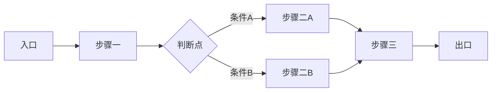
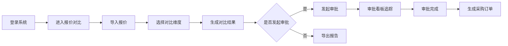

# 产品设计流程

**何时使用**: 设计产品方案、规划功能、定义用户体验时

---

## 流程概述

产品设计流程整合三大方法论，形成完整的「发现问题→定义问题→解决问题→交付方案」链路：

```
┌─────────────────────────────────────────────────────────────────────────────┐
│                        产品设计流程全景                                        │
├─────────────────────────────────────────────────────────────────────────────┤
│  Design Thinking 五步法                                                      │
│  同理心 → 定义 → 构思 → 原型 → 测试                                            │
│       ↓        ↓       ↓       ↓       ↓                                     │
│  ┌─────────────────────────────────────────────────────────────────────┐    │
│  │  双钻模型（四阶段）                                                    │    │
│  │  第一钻石：发现问题        第二钻石：解决问题                           │    │
│  │  Discover → Define    →    Develop → Deliver                         │    │
│  │  （发散）    （收敛）        （发散）    （收敛）                        │    │
│  └─────────────────────────────────────────────────────────────────────┘    │
│       ↓        ↓       ↓       ↓       ↓                                     │
│  UX 五要素（自下而上构建）                                                     │
│  战略层 → 范围层 → 结构层 → 骨架层 → 表现层                                    │
│       ↓        ↓       ↓       ↓       （UI skill 处理）                      │
│  ┌─────────────────────────────────────────────────────────────────────┐    │
│  │  强制输出映射到 PRD 章节                                               │    │
│  │  战略层 → 一、执行摘要 + 二、成功标准                                   │    │
│  │  范围层 → 三、产品范围                                                  │    │
│  │  结构层 → 五、用户旅程 + 八、功能菜单层级                               │    │
│  │  骨架层 → 六、业务流程 + 线框图设计说明                                 │    │
│  └─────────────────────────────────────────────────────────────────────┘    │
└─────────────────────────────────────────────────────────────────────────────┘
```

---

## 一、Design Thinking 五步法执行

### 1.1 步骤一：同理心（Empathize）

**目标**: 深入理解用户真实需求，而非假设需求

**AI 执行动作**:

| 序号 | 动作 | 输出格式 | 验证标准 |
|------|------|----------|----------|
| 1 | 识别用户输入中的用户角色信息 | 用户角色清单 | ≥1 个角色 |
| 2 | 构建同理心地图 | 同理心地图四象限 | 四象限均有内容 |
| 3 | 提取用户痛点 | 痛点清单（带优先级） | ≥3 个痛点 |
| 4 | 提取用户收益期望 | 收益清单 | ≥2 个收益 |

**同理心地图模板**:

```
┌─────────────────────────────────────────────────────────────────┐
│                        同理心地图                                │
├─────────────────────┬───────────────────────────────────────────┤
│   【想/感受】        │              【听】                        │
│   用户内心想法       │   用户从他人/环境听到的信息                 │
│   - ...             │   - ...                                    │
│   - ...             │   - ...                                    │
├─────────────────────┤                                           │
│   【看】            │                                           │
│   用户看到的环境     │                                           │
│   - ...             │                                           │
│   - ...             │                                           │
│                     ├───────────────────────────────────────────┤
│                     │              【说/做】                      │
│                     │   用户公开的行为和言语                       │
│                     │   - ...                                    │
│                     │   - ...                                    │
├─────────────────────┼───────────────────────────────────────────┤
│   【痛点】          │              【收益】                        │
│   用户困扰和挫折     │   用户期望获得的价值                        │
│   - P1: ...         │   - ...                                    │
│   - P2: ...         │   - ...                                    │
│   - P3: ...         │                                            │
└─────────────────────┴───────────────────────────────────────────┘
```

**执行检查清单**:

```
同理心步骤执行检查：
├── ☐ 用户角色已识别（数量：N）
├── ☐ 同理心地图四象限已填写
├── ☐ 痛点清单已输出（数量：≥3）
├── ☐ 收益清单已输出（数量：≥2）
└── ✓ 同理心步骤完成
```

---

### 1.2 步骤二：定义（Define）

**目标**: 聚焦核心问题，形成清晰的问题陈述

**AI 执行动作**:

| 序号 | 动作 | 输出格式 | 验证标准 |
|------|------|----------|----------|
| 1 | 从痛点中选择核心痛点 | 核心痛点（≤3 个） | 有优先级排序 |
| 2 | 构建 POV 陈述 | POV 陈述（每个核心痛点 1 条） | 格式正确 |
| 3 | 转换为 HMW 问题 | HMW 问题清单 | 每个 POV → 1 个 HMW |
| 4 | 确认问题聚焦范围 | 问题聚焦声明 | 明确边界 |

**POV 陈述格式**:

```
POV 陈述模板：
[用户角色] 需要 [核心需求]，因为 [洞察发现]

示例：
采购专员 需要快速对比多家供应商报价，因为 手工整理报价表耗时且容易出错
```

**HMW 问题转换规则**:

```
转换规则：将 POV 中的「因为」部分转化为 HMW 问题

POV: 采购专员 需要快速对比多家供应商报价，因为 手工整理报价表耗时且容易出错
HMW: How Might We 让采购专员无需手工整理就能快速对比报价？

转换步骤：
1. 提取「因为」后的痛点描述
2. 转换为「如何能够...」的问题形式
3. 确保问题开放、可发散
```

**执行检查清单**:

```
定义步骤执行检查：
├── ☐ 核心痛点已筛选（数量：≤3）
├── ☐ POV 陈述已构建（数量：与核心痛点一致）
├── ☐ HMW 问题已转换（数量：与 POV 一致）
├── ☐ 问题聚焦范围已声明
└── ✓ 定义步骤完成
```

---

### 1.3 步骤三：构思（Ideate）

**目标**: 发散生成多种解决方案，不评判可行性

**AI 执行动作**:

| 序号 | 动作 | 输出格式 | 验证标准 |
|------|------|----------|----------|
| 1 | 对每个 HMW 问题进行头脑风暴 | 方案清单（每个 HMW ≥3 方案） | 方案数量达标 |
| 2 | 应用 SCAMPER 技术扩展方案 | SCAMPER 扩展方案 | 至少应用 2 种技术 |
| 3 | 方案归类整理 | 方案分类表 | 有分类维度 |
| 4 | 初步可行性标记 | 方案可行性标记 | 不排除任何方案 |

**SCAMPER 技术应用**:

| 技术 | 问题 | 应用示例 |
|------|------|----------|
| Substitute（替代） | 能否用其他方式替代？ | 用自动导入替代手工录入 |
| Combine（合并） | 能否与其他功能合并？ | 报价对比与审批流程合并 |
| Adapt（调整） | 能否借鉴其他方案？ | 借鉴电商比价功能设计 |
| Modify（修改） | 能否改变规模/形式？ | 从单次对比改为批量对比 |
| Put to other uses（其他用途） | 能否用于其他场景？ | 报价数据用于供应商评估 |
| Eliminate（删除） | 能否删除不必要的？ | 删除重复录入步骤 |
| Reverse（反转） | 能否颠倒顺序/角色？ | 供应商主动提交报价 |

**方案分类维度**:

```
方案分类表模板：
┌─────────────────────────────────────────────────────────────────┐
│  HMW 问题：How Might We 让采购专员无需手工整理就能快速对比报价？  │
├────────────┬────────────┬────────────┬──────────────────────────┤
│  方案编号  │  方案描述   │  分类维度  │  初步可行性标记           │
├────────────┼────────────┼────────────┼──────────────────────────┤
│  S-01      │  自动导入   │  技术方案  │  可行                    │
│  S-02      │  标准模板   │  流程方案  │  可行                    │
│  S-03      │  供应商直报 │  业务方案  │  需评估                  │
│  ...       │  ...       │  ...       │  ...                     │
└────────────┴────────────┴────────────┴──────────────────────────┘
```

**执行检查清单**:

```
构思步骤执行检查：
├── ☐ 每个 HMW 问题已头脑风暴（方案数量：≥3/HMW）
├── ☐ SCAMPER 技术已应用（应用技术数量：≥2）
├── ☐ 方案已归类整理
├── ☐ 方案可行性已标记（不排除任何方案）
└── ✓ 构思步骤完成
```

---

### 1.4 步骤四：原型（Prototype）

**目标**: 快速构建低保真原型，验证方案可行性

**AI 执行动作**:

| 序号 | 动作 | 输出格式 | 验证标准 |
|------|------|----------|----------|
| 1 | 选择核心方案进行原型设计 | 原型方案选择说明 | 有选择理由 |
| 2 | 设计核心流程路径 | 核心流程路径图（Mermaid） | 流程完整 |
| 3 | 设计关键页面布局 | 页面布局说明（非线框图） | 布局决策明确 |
| 4 | 定义交互方式 | 交互方式清单 | 操作反馈明确 |

**核心流程路径图模板**:



**页面布局说明模板**:

```
页面布局说明（骨架层输出）：
┌─────────────────────────────────────────────────────────────────┐
│  页面名称：报价对比页                                            │
├─────────────────────────────────────────────────────────────────┤
│  布局决策：                                                      │
│  - 顶部：筛选条件区（供应商、日期范围、物料类别）                  │
│  - 中部：报价对比表格（横向对比，纵向物料列表）                    │
│  - 底部：操作按钮区（生成对比报告、发起审批）                      │
│                                                                  │
│  信息呈现优先级：                                                │
│  1. 价格差异（高亮显示）                                          │
│  2. 供应商评分                                                   │
│  3. 交货周期                                                     │
│                                                                  │
│  交互方式：                                                      │
│  - 点击行：展开该物料详细报价                                    │
│  - 勾选列：选择参与对比的供应商                                  │
│  - 导出：生成 Excel 对比报告                                     │
└─────────────────────────────────────────────────────────────────┘
```

**执行检查清单**:

```
原型步骤执行检查：
├── ☐ 核心方案已选择（有选择理由）
├── ☐ 核心流程路径图已设计（Mermaid 格式）
├── ☐ 关键页面布局说明已输出
├── ☐ 交互方式清单已定义
└── ✓ 原型步骤完成
```

---

### 1.5 步骤五：测试（Test）

**目标**: 验证方案是否解决核心问题，收集改进反馈

**AI 执行动作**:

| 序号 | 动作 | 输出格式 | 验证标准 |
|------|------|----------|----------|
| 1 | 设计验证场景 | 验证场景清单 | ≥3 个场景 |
| 2 | 定义验证标准 | 验收标准（Given-When-Then） | 每个场景有标准 |
| 3 | 识别潜在问题 | 潜在问题清单 | 有改进建议 |
| 4 | 确认方案可行性 | 方案可行性结论 | 有明确结论 |

**验收标准格式**:

```
验收标准模板（Given-When-Then）：
Given [前置条件]
When [用户操作]
Then [预期结果]

示例：
Given 采购专员已导入 3 家供应商报价
When 点击「生成对比报告」
Then 系统生成包含价格差异、评分、交货周期的对比报告
```

**执行检查清单**:

```
测试步骤执行检查：
├── ☐ 验证场景已设计（数量：≥3）
├── ☐ 验收标准已定义（数量：与场景一致）
├── ☐ 潜在问题已识别
├── ☐ 方案可行性结论已确认
└── ✓ 测试步骤完成
```

---

## 二、双钻模型执行

### 2.1 第一钻石：发现问题

#### 2.1.1 Discover（发散阶段）

**目标**: 广泛探索，不设边界

**发散技术**:

| 技术 | 执行动作 | 输出 |
|------|----------|------|
| 用户研究 | 分析用户输入中的用户信息 | 用户画像清单 |
| 业务调研 | 分析用户输入中的业务场景 | 业务场景清单 |
| 竞品参考 | 提取用户输入中的参考系统 | 参考系统清单 |
| 问题收集 | 收集所有提及的问题和痛点 | 问题清单（不筛选） |

**发散输出模板**:

```
Discover 发散输出：
┌─────────────────────────────────────────────────────────────────┐
│  用户画像：                                                      │
│  - 角色 1：采购专员（主要用户）                                   │
│  - 角色 2：采购经理（审批用户）                                   │
│  - 角色 3：供应商（外部用户）                                     │
│                                                                  │
│  业务场景：                                                      │
│  - 场景 1：日常询价比价                                          │
│  - 场景 2：紧急采购                                              │
│  - 场景 3：年度供应商评估                                        │
│                                                                  │
│  参考系统：                                                      │
│  - 系统 1：现有 ERP 采购模块                                     │
│  - 系统 2：某 SaaS 采购平台                                      │
│                                                                  │
│  问题清单（不筛选）：                                            │
│  - 问题 1：手工录入报价耗时                                      │
│  - 问题 2：报价格式不统一                                        │
│  - 问题 3：对比维度单一                                          │
│  - 问题 4：审批流程不透明                                        │
│  - ...                                                           │
└─────────────────────────────────────────────────────────────────┘
```

#### 2.1.2 Define（收敛阶段）

**目标**: 聚焦核心问题，明确边界

**收敛技术**:

| 技术 | 执行动作 | 输出 |
|------|----------|------|
| 问题筛选 | 从问题清单筛选核心问题 | 核心问题清单（≤3） |
| POV 构建 | 构建问题陈述 | POV 陈述 |
| HMW 转换 | 转换为开放问题 | HMW 问题 |
| 边界定义 | 定义问题边界 | 问题边界声明 |

**收敛输出模板**:

```
Define 收敛输出：
┌─────────────────────────────────────────────────────────────────┐
│  核心问题筛选结果：                                              │
│  - 核心问题 1：报价对比效率低（优先级：P1）                       │
│  - 核心问题 2：审批流程不透明（优先级：P2）                       │
│                                                                  │
│  POV 陈述：                                                      │
│  - POV-1：采购专员需要快速对比报价，因为手工整理耗时易错          │
│  - POV-2：采购经理需要透明的审批进度，因为无法追踪审批状态        │
│                                                                  │
│  HMW 问题：                                                      │
│  - HMW-1：如何让采购专员无需手工整理就能快速对比报价？            │
│  - HMW-2：如何让采购经理实时追踪审批进度？                        │
│                                                                  │
│  问题边界：                                                      │
│  - In Scope：报价对比、审批追踪                                  │
│  - Out of Scope：供应商管理、合同管理                            │
└─────────────────────────────────────────────────────────────────┘
```

---

### 2.2 第二钻石：解决问题

#### 2.2.1 Develop（发散阶段）

**目标**: 发散方案，探索可能性

**发散技术**:

| 技术 | 执行动作 | 输出 |
|------|----------|------|
| 方案头脑风暴 | 对每个 HMW 生成多个方案 | 方案清单（≥3/HMW） |
| SCAMPER 扩展 | 应用 SCAMPER 技术扩展 | 扩展方案 |
| 方案组合 | 组合多个方案形成综合方案 | 综合方案清单 |
| 技术可行性评估 | 初步评估技术可行性 | 可行性标记 |

**发散输出模板**:

```
Develop 发散输出：
┌─────────────────────────────────────────────────────────────────┐
│  HMW-1 方案发散：                                                │
│  - S-01：自动导入报价（技术方案）                                │
│  - S-02：标准化报价模板（流程方案）                              │
│  - S-03：供应商直报系统（业务方案）                              │
│  - S-04：智能报价解析（技术方案，SCAMPER-Adapt）                 │
│  - S-05：批量对比模式（技术方案，SCAMPER-Modify）                │
│                                                                  │
│  HMW-2 方案发散：                                                │
│  - S-06：审批进度看板（技术方案）                                │
│  - S-07：消息通知推送（技术方案）                                │
│  - S-08：审批流程可视化（技术方案）                              │
│                                                                  │
│  综合方案组合：                                                  │
│  - 组合方案 A：S-01 + S-06（报价自动导入 + 审批看板）             │
│  - 组合方案 B：S-03 + S-07 + S-08（供应商直报 + 通知 + 可视化）  │
└─────────────────────────────────────────────────────────────────┘
```

#### 2.2.2 Deliver（收敛阶段）

**目标**: 完善方案，准备交付

**收敛技术**:

| 技术 | 执行动作 | 输出 |
|------|----------|------|
| 方案筛选 | 选择最优方案 | 最终方案 |
| 流程细化 | 设计详细流程 | 流程路径图 |
| 布局定义 | 定义页面布局决策 | 布局说明 |
| MVP 定义 | 定义 MVP 范围 | MVP 功能矩阵 |

**收敛输出模板**:

```
Deliver 收敛输出：
┌─────────────────────────────────────────────────────────────────┐
│  最终方案选择：                                                  │
│  - 选择组合方案 A：报价自动导入 + 审批看板                        │
│  - 选择理由：技术可行性高、实施周期短、覆盖核心痛点               │
│                                                                  │
│  流程细化：                                                      │
│  - 核心流程 1：报价导入对比流程                                  │
│  - 核心流程 2：审批追踪流程                                      │
│                                                                  │
│  MVP 定义：                                                      │
│  ┌────────────┬────────────┬────────────┬────────────┐           │
│  │  功能      │  业务价值  │  实现难度  │  MVP 决策  │           │
│  ├────────────┼────────────┼────────────┼────────────┤           │
│  │  报价导入  │  高        │  中        │  P0 包含   │           │
│  │  对比表格  │  高        │  低        │  P0 包含   │           │
│  │  审批看板  │  高        │  中        │  P0 包含   │           │
│  │  消息推送  │  中        │  中        │  P1 包含   │           │
│  │  智能解析  │  中        │  高        │  P2 暂不   │           │
│  └────────────┴────────────┴────────────┴────────────┘           │
└─────────────────────────────────────────────────────────────────┘
```

---

## 三、UX 五要素详细应用

### 3.1 战略层（Strategy Layer）

**核心问题**: 我们要什么？用户要什么？

**AI 执行动作**:

| 序号 | 动作 | 输出格式 | PRD 映射章节 |
|------|------|----------|--------------|
| 1 | 定义产品目标 | 产品目标清单 | 一、执行摘要 |
| 2 | 定义用户需求 | 用户需求清单 | 一、执行摘要 |
| 3 | 定义成功指标 | 成功指标清单 | 二、成功标准 |
| 4 | 定义品牌标识 | 品牌标识说明 | 一、执行摘要 |

**战略层输出模板**:

```markdown
## 战略层输出

### 产品目标
- 商业目标：提升采购效率 30%，降低采购成本 10%
- 品牌标识：高效、透明、可信赖的采购管理工具

### 用户需求
- 目标用户：采购专员、采购经理
- 核心需求：快速报价对比、透明审批追踪
- 使用场景：日常询价、紧急采购、年度评估

### 成功指标
| 指标类型 | 指标名称 | 目标值 | 衡量方式 |
|----------|----------|--------|----------|
| 业务指标 | 报价对比效率 | 提升 30% | 对比耗时统计 |
| 业务指标 | 采购成本 | 降低 10% | 成本数据分析 |
| 用户指标 | 用户满意度 | ≥ 85% | 季度调研 |
| 用户指标 | 核心流程完成率 | ≥ 90% | 流程走查 |
```

**强制验证**:

```
战略层强制验证：
├── ☐ 产品目标已定义（数量：≥1）
├── ☐ 用户需求已定义（数量：≥1）
├── ☐ 成功指标已定义（数量：≥2）
│   ├── ☐ 业务指标（数量：≥1）
│   └── ☐ 用户指标（数量：≥1）
├── ☐ 输出已映射到 PRD 章节
│   ├── ☐ 一、执行摘要
│   └── ☐ 二、成功标准
└── ✓ 战略层完成（否则流程未实质执行）
```

---

### 3.2 范围层（Scope Layer）

**核心问题**: 做什么？不做什么？

**AI 执行动作**:

| 序号 | 动作 | 输出格式 | PRD 映射章节 |
|------|------|----------|--------------|
| 1 | 定义 In Scope | In Scope 功能清单 | 三、产品范围 |
| 2 | 定义 Out of Scope | Out of Scope 清单 | 三、产品范围 |
| 3 | 构建 MVP 功能矩阵 | MVP 功能筛选矩阵 | 三、产品范围 |
| 4 | 定义功能优先级 | 功能优先级表 | 三、产品范围 |

**范围层输出模板**:

```markdown
## 范围层输出

### In Scope（做什么）
- 报价导入与对比
- 审批进度追踪
- 对比报告生成
- 消息通知推送

### Out of Scope（不做什么）
- 供应商管理（已有独立模块）
- 合同管理（已有独立模块）
- 采购订单生成（下一版本规划）

### MVP 功能筛选矩阵
┌─────────────────────────────────────────────────────────────────┐
│                        业务价值                                  │
│           高                    中                    低         │
├─────────────────────┬─────────────────────┬─────────────────────┤
│  实现难度           │                     │                     │
│  低                 │  P0 必须包含         │  P1 优先包含         │
│                     │  - 对比表格          │  - 消息推送          │
│                     │                     │                     │
│  中                 │  P0 必须包含         │  P1 优先包含         │
│                     │  - 报价导入          │  - 报告生成          │
│                     │  - 审批看板          │                     │
│                     │                     │                     │
│  高                 │  P1 优先包含         │  P2 暂不包含         │
│                     │  - 智能解析          │  - 批量导入          │
└─────────────────────┴─────────────────────┴─────────────────────┘

### 功能优先级表
| 功能编号 | 功能名称 | 优先级 | MVP 决策 | 依赖功能 |
|----------|----------|--------|----------|----------|
| F-01 | 报价导入 | P0 | 包含 | 无 |
| F-02 | 对比表格 | P0 | 包含 | F-01 |
| F-03 | 审批看板 | P0 | 包含 | 无 |
| F-04 | 消息推送 | P1 | 包含 | F-03 |
| F-05 | 报告生成 | P1 | 包含 | F-02 |
| F-06 | 智能解析 | P2 | 暂不 | F-01 |
```

**强制验证**:

```
范围层强制验证：
├── ☐ In Scope 已定义（数量：≥1）
├── ☐ Out of Scope 已定义（数量：≥1）
├── ☐ MVP 功能筛选矩阵已构建
│   ├── ☐ 业务价值维度已评估
│   ├── ☐ 实现难度维度已评估
│   └── ☐ MVP 决策已明确
├── ☐ 功能优先级表已输出
├── ☐ 输出已映射到 PRD 章节
│   └── ☐ 三、产品范围
└── ✓ 范围层完成（否则流程未实质执行）
```

---

### 3.3 结构层（Structure Layer）

**核心问题**: 如何组织？如何交互？

**AI 执行动作**:

| 序号 | 动作 | 输出格式 | PRD 映射章节 |
|------|------|----------|--------------|
| 1 | 设计信息架构树 | 信息架构树（树形结构） | 八、功能菜单层级 |
| 2 | 设计核心流程路径 | 核心流程路径图 | 五、用户旅程 |
| 3 | 定义用户旅程 | 用户旅程地图 | 五、用户旅程 |
| 4 | 定义交互流程 | 交互流程说明 | 五、用户旅程 |

**结构层输出模板**:

```markdown
## 结构层输出

### 信息架构树
采购管理
├── 报价对比
│   ├── 报价导入
│   ├── 对比分析
│   └── 报告生成
├── 审批追踪
│   ├── 审批看板
│   ├── 审批详情
│   └── 消息通知
└── 数据统计
    ├── 对比统计
    └── 审批统计

### 核心流程路径


### 用户旅程地图
┌─────────────────────────────────────────────────────────────────┐
│  用户角色：采购专员                                              │
│  目标：完成报价对比并发起审批                                    │
├────────────┬────────────┬────────────┬────────────┬─────────────┤
│  阶段      │  用户行为   │  系统响应  │  用户情绪   │  改进机会   │
├────────────┼────────────┼────────────┼────────────┼─────────────┤
│  1.导入    │  上传报价   │  解析数据  │  期待       │  支持多格式 │
│  2.对比    │  选择维度   │  生成对比  │  满意       │  智能推荐   │
│  3.决策    │  选择供应商 │  记录决策  │  自信       │  决策辅助   │
│  4.审批    │  发起审批   │  推送通知  │  安心       │  进度可视化 │
│  5.完成    │  确认结果   │  生成订单  │  满足       │  自动流转   │
└────────────┴────────────┴────────────┴────────────┴─────────────┘
```

**强制验证**:

```
结构层强制验证：
├── ☐ 信息架构树已设计
│   ├── ☐ 一级模块已定义
│   ├── ☐ 二级功能已定义
│   └── ☐ 三级功能已定义（如需要）
├── ☐ 核心流程路径图已设计（Mermaid 格式）
├── ☐ 用户旅程地图已定义
│   ├── ☐ 用户角色已明确
│   ├── ☐ 阶段已划分
│   └── ☐ 用户行为/系统响应已定义
├── ☐ 输出已映射到 PRD 章节
│   ├── ☐ 五、用户旅程
│   └── ☐ 八、功能菜单层级
└── ✓ 结构层完成（否则流程未实质执行）
```

---

### 3.4 骨架层（Skeleton Layer）

**核心问题**: 如何呈现？如何操作？

**AI 执行动作**:

| 序号 | 动作 | 输出格式 | PRD 映射章节 |
|------|------|----------|--------------|
| 1 | 设计关键页面布局 | 页面布局说明 | 六、业务流程 + 线框图设计说明 |
| 2 | 定义信息呈现优先级 | 信息优先级清单 | 线框图设计说明 |
| 3 | 定义交互方式 | 交互方式清单 | 线框图设计说明 |
| 4 | 定义导航结构 | 导航结构说明 | 八、功能菜单层级 |

**骨架层输出模板**:

```markdown
## 骨架层输出

### 关键页面布局说明

#### 页面 1：报价对比页
布局结构：
- 顶部区域：筛选条件（供应商、日期、物料类别）
- 中部区域：对比表格（横向供应商，纵向物料）
- 底部区域：操作按钮（生成报告、发起审批）

信息呈现优先级：
1. 价格差异（高亮显示最大差异）
2. 供应商评分（星级展示）
3. 交货周期（天数展示）

交互方式：
- 点击行：展开物料详细报价
- 勾选列：选择参与对比的供应商
- 双击单元格：查看报价详情
- 导出按钮：生成 Excel 报告

#### 页面 2：审批看板页
布局结构：
- 左侧区域：待审批列表
- 中部区域：审批详情
- 右侧区域：审批历史

信息呈现优先级：
1. 审批状态（进度条）
2. 当前审批人
3. 审批意见

交互方式：
- 点击卡片：查看审批详情
- 拖拽卡片：调整审批顺序
- 筛选按钮：按状态筛选

### 导航结构
顶部导航：首页 | 报价对比 | 审批追踪 | 数据统计
侧边导航：按信息架构树展开
```

**强制验证**:

```
骨架层强制验证：
├── ☐ 关键页面布局说明已输出
│   ├── ☐ 页面数量：≥核心功能数量
│   ├── ☐ 布局结构已定义
│   ├── ☐ 信息优先级已定义
│   └── ☐ 交互方式已定义
├── ☐ 导航结构已定义
├── ☐ 输出已映射到 PRD 章节
│   ├── ☐ 六、业务流程
│   └── ☐ 线框图设计说明
└── ✓ 骨架层完成（否则流程未实质执行）
```

---

### 3.5 表现层（Presentation Layer）

**说明**: 表现层涉及视觉设计，由 UI/UX skill（ui-ux-pro-max）处理，不在本流程输出范围内。

**边界声明**:

```
表现层边界：
- 本流程不输出视觉设计规范
- 本流程不输出配色方案
- 本流程不输出图标设计
- 以上内容由 ui-ux-pro-max skill 处理
```

---

## 四、强制输出映射验证

### 4.1 UX 五要素 → PRD 章节映射表

| UX 要素层 | 必须输出的内容 | 对应 PRD 章节 | 验证标准 |
|-----------|---------------|---------------|----------|
| **战略层** | 商业目标 + 用户核心需求 + 成功指标 | 一、执行摘要 + 二、成功标准 | 成功指标 ≥2 个 |
| **范围层** | In Scope / Out of Scope + MVP 功能筛选矩阵 | 三、产品范围 | MVP 矩阵已构建 |
| **结构层** | 信息架构树 + 核心流程路径 | 五、用户旅程 + 八、功能菜单层级 | 流程图可渲染 |
| **骨架层** | 关键页面布局说明（非线框图，是布局决策） | 六、业务流程 + 线框图设计说明 | 页面数量达标 |

### 4.2 执行失败信号

以下情况视为流程未实质执行：

| 失败信号 | 说明 |
|----------|------|
| 战略层无成功指标 | 成功指标数量 < 2 |
| 范围层无 MVP 矩阵 | MVP 功能筛选矩阵缺失 |
| 结构层无信息架构树 | 信息架构树缺失或层级不完整 |
| 骨架层无页面布局说明 | 关键页面布局说明缺失 |
| 四层均无对应产出 | 所有 UX 层输出缺失 |

### 4.3 流程完成验证清单

```
产品设计流程完成验证：
├── ☐ Design Thinking 五步法已执行
│   ├── ☐ 同理心：同理心地图已输出
│   ├── ☐ 定义：POV + HMW 已输出
│   ├── ☐ 构思：方案清单已输出
│   ├── ☐ 原型：流程路径 + 布局说明已输出
│   └── ☐ 测试：验收标准已输出
├── ☐ 双钻模型四阶段已执行
│   ├── ☐ Discover：发散输出已输出
│   ├── ☐ Define：收敛输出已输出
│   ├── ☐ Develop：方案发散已输出
│   └── ☐ Deliver：方案收敛已输出
├── ☐ UX 五要素四层已输出
│   ├── ☐ 战略层：成功指标 ≥2 个 ✓
│   ├── ☐ 范围层：MVP 矩阵已构建 ✓
│   ├── ☐ 结构层：信息架构 + 流程路径 ✓
│   ├── ☐ 骨架层：页面布局说明 ✓
├── ☐ 强制输出映射已验证
│   ├── ☐ 战略层 → 一、执行摘要 + 二、成功标准
│   ├── ☐ 范围层 → 三、产品范围
│   ├── ☐ 结构层 → 五、用户旅程 + 八、功能菜单层级
│   ├── ☐ 骨架层 → 六、业务流程 + 线框图设计说明
└── ✓ 产品设计流程完成
```

---

## 五、输入→处理→输出完整链路

### 5.1 流程衔接关系

```
┌─────────────────────────────────────────────────────────────────────────────┐
│                        产品设计流程衔接链路                                    │
├─────────────────────────────────────────────────────────────────────────────┤
│                                                                              │
│  上游输入（流程一：需求分析）                                                  │
│  ├── 用户角色清单                                                             │
│  ├── 业务场景清单                                                             │
│  ├── 需求点清单（带优先级）                                                    │
│  └── 追问确认表                                                               │
│       ↓                                                                       │
│  ┌─────────────────────────────────────────────────────────────────────┐    │
│  │  本流程：产品设计                                                    │    │
│  │  输入：需求分析输出                                                  │    │
│  │  处理：Design Thinking + 双钻模型 + UX 五要素                        │    │
│  │  输出：UX 四层输出（战略层/范围层/结构层/骨架层）                     │    │
│  └─────────────────────────────────────────────────────────────────────┘    │
│       ↓                                                                       │
│  下游输出（传递给后续流程）                                                    │
│  ├── 流程三：业务建模 → 使用结构层输出                                         │
│  ├── 流程四：功能架构 → 使用范围层 MVP 矩阵                                    │
│  ├── 流程五：PRD 编写 → 使用全部 UX 四层输出                                   │
│  ├── 流程六：线框图生成 → 使用骨架层布局说明                                   │
│                                                                              │
└─────────────────────────────────────────────────────────────────────────────┘
```

### 5.2 输出传递表

| 本流程输出 | 传递给 | 下游流程使用方式 |
|------------|--------|------------------|
| 战略层输出 | 流程五：PRD 编写 | 填入一、执行摘要 + 二、成功标准 |
| 范围层 MVP 矩阵 | 流程四：功能架构 | 作为功能点拆解输入 |
| 范围层输出 | 流程五：PRD 编写 | 填入三、产品范围 |
| 结构层信息架构 | 流程三：业务建模 | 作为业务活动定义参考 |
| 结构层输出 | 流程五：PRD 编写 | 填入五、用户旅程 + 八、功能菜单层级 |
| 骨架层布局说明 | 流程六：线框图生成 | 作为线框图设计输入 |
| 骨架层输出 | 流程五：PRD 编写 | 填入六、业务流程 + 线框图设计说明 |

---

## 六、设计输出模板

### 6.1 产品设计方案模板

```markdown
## 产品设计方案

### 一、问题定义
- 用户痛点：[从同理心地图提取]
- 业务目标：[从战略层提取]
- POV 陈述：[从定义步骤提取]
- HMW 问题：[从定义步骤提取]

### 二、解决方案
- 核心功能：[从构思步骤提取]
- 差异化：[从方案对比提取]
- MVP 范围：[从范围层提取]

### 三、信息架构
[模块名称]
├── [功能 1]
│   ├── [子功能 1.1]
│   └── [子功能 1.2]
└── [功能 2]

### 四、核心流程
[Mermaid 流程图]

### 五、关键页面布局
[页面布局说明]

### 六、MVP 定义
| 功能 | 业务价值 | 实现难度 | MVP 决策 |
|------|----------|----------|----------|
| ... | ... | ... | ... |

### 七、成功指标
| 指标类型 | 指标名称 | 目标值 |
|----------|----------|--------|
| ... | ... | ... |
```

---

## 七、方法论参考索引

| 方法论 | 详细文档 | 何时加载 |
|--------|----------|----------|
| Design Thinking 五步法 | `@../product-design.md#Design-Thinking` | 执行同理心/定义/构思步骤 |
| POV/HMW 格式 | `@../product-design.md#POV陈述格式` | 构建问题陈述 |
| 同理心地图模板 | `@../product-design.md#同理心地图模板` | 执行同理心步骤 |
| 双钻模型四阶段 | `@../product-design.md#双钻模型` | 执行发散/收敛阶段 |
| UX 五要素详解 | `@../product-design.md#UX五要素` | 执行 UX 层输出 |
| MVP 功能筛选矩阵 | `@../product-design.md#MVP设计方法` | 定义 MVP 范围 |

---

## 版本

- v1.1
- 更新: 2025-04-14
- 变更: 从骨架扩展为完整可执行流程，新增 Design Thinking 五步法详细执行、双钻模型发散/收敛技术、UX 五要素强制输出验证、输入→处理→输出完整链路