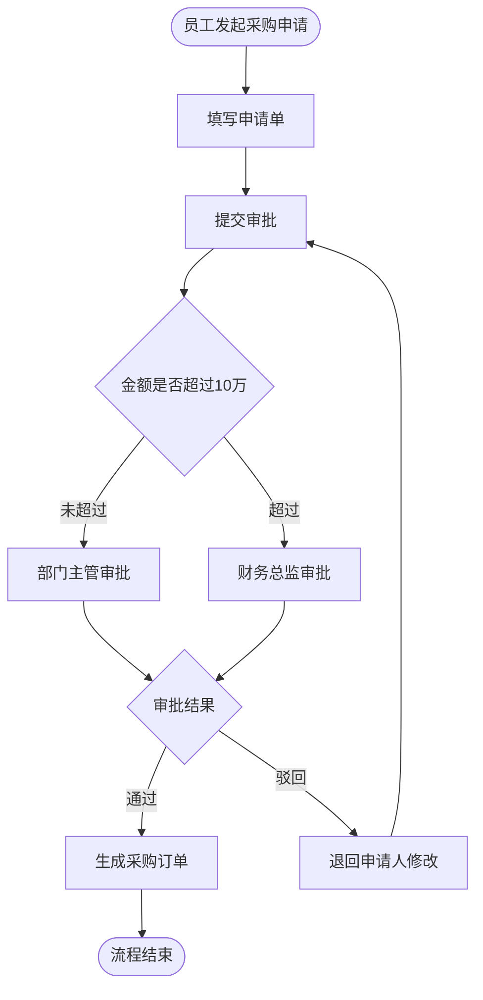
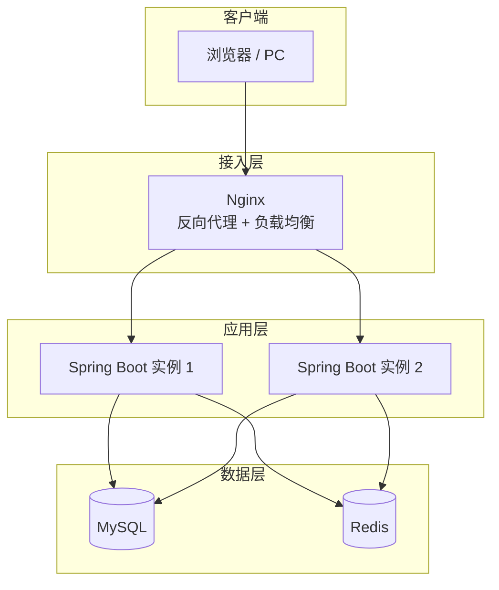

# diagram-guides

## 规则总则

能用表格清晰表达的结构关系，优先用表格。只有需要表达流转、分支、时序的场景，才使用 Mermaid。

| 图类型 | 格式 | 所在章节 |
|---|---|---|
| 功能架构图 | Markdown 表格 | 第 2 章 |
| 核心业务流程图 | Mermaid flowchart | 第 2 章 |
| 系统架构图 | Mermaid 示意 + 组件表格 | 第 3 章 |
| 技术架构图 | Markdown 表格 | 第 3 章 |

每张图前写一句引导语（说明展示什么），图后写文字补充（说明图中无法完整表达的内容）。

---

## 功能架构图（Markdown 表格）

**数据来源：** Step 4 域模型的输出结果。

**排列顺序：** 系统管理域 → 核心业务域 → 支撑业务域 → 分析报表域。

**表格结构：**

| 业务域 | 功能模块 | 主要功能点 | 优先级 |
|---|---|---|---|
| 系统管理域 | 用户管理 | 用户新增/编辑/禁用、密码重置、登录日志查询 | P0 |
| 系统管理域 | 角色权限 | 角色配置、菜单权限分配、按钮级权限控制 | P0 |
| {核心业务域} | {模块名} | {功能点1}、{功能点2}（3-6 个，含隐性需求推导出的功能点）| P0/P1/P2 |
| 分析报表域 | {模块名} | {功能点} | P1/P2 |

---

## 核心业务流程图（Mermaid flowchart）

**使用条件：** 仅流程审批类模块画流程图，最多 3 张，选最能体现系统价值的核心流程。

**必须包含：** 主流程（正常通过路径）+ 驳回路径 + 至少一个关键条件分支。

**节点命名：**
- 操作节点：动宾结构（"填写申请单"、"提交审批"）
- 判断节点：疑问句（"金额是否超限？"）
- 开始/结束：`([角色+动作])`

**Mermaid 语法规范：**
- 节点 ID 用英文字母，不用中文或特殊字符
- 单图节点控制在 15 个以内
- 连接线标注文字不超过 10 个字

多角色协作场景改用 `sequenceDiagram`（强调消息传递时更清晰）。

---

## 系统架构图（Mermaid 示意 + 组件表格）

**Mermaid 示意（表达组件调用关系）：**

Mermaid 示意后注明：
> *以上为组件调用关系示意，实际部署的网络边界和服务器分配见下方组件说明表。*

**组件说明表（补充 Mermaid 无法表达的细节）：**

| 组件 | 类型 | 职责说明 | 关键说明 |
|---|---|---|---|
| Nginx | 反向代理 | 静态资源服务、请求转发、SSL 终止、负载均衡 | 配置健康检查，实例故障时自动摘除 |
| Spring Boot | 应用服务 | 业务逻辑处理、RESTful API | 无状态设计，支持多实例水平扩展 |
| MySQL | 关系型数据库 | 业务主数据持久化 | 不直接暴露公网，只允许应用服务器内网访问 |
| Redis | 缓存服务 | 缓存、会话、幂等控制 | 故障时降级直接查 MySQL |
| Quartz | 任务调度 | 定时任务执行 | 内嵌于 Spring Boot；集群模式依赖 MySQL 存储任务状态 |

如有外部系统，在 Mermaid 图中增加外部系统节点（用虚线区分），在组件表格中增加对应行说明集成方式和数据流向。

---

## 技术架构图（Markdown 表格）

根据实际引入的组件填充，未引入的组件删除对应行。

| 层次 | 技术组件 | 职责定位 |
|---|---|---|
| 前端展现层 | Vue 3 | 前端框架，组件化开发，响应式数据绑定 |
| 前端展现层 | Ant Design Vue | UI 组件库，提供中后台标准页面组件 |
| 前端展现层 | Vue Router | 路由管理，支持基于权限的动态路由生成 |
| 前端展现层 | Pinia | 全局状态管理，存储用户信息和权限数据 |
| 前端展现层 | Axios | HTTP 请求封装，统一请求拦截和错误处理 |
| 前端展现层 | ECharts | 数据可视化图表（按需引入）|
| 接入层 | Nginx | 反向代理、静态资源服务、负载均衡、SSL 终止 |
| 后端应用层 | Spring Boot 3.x | 应用主框架，承载全部业务逻辑，提供 RESTful API |
| 后端应用层 | Spring Security | 认证鉴权，结合 JWT 实现无状态接口安全控制 |
| 后端应用层 | MyBatis Plus | ORM 框架，封装数据库访问，提供通用 CRUD 和分页 |
| 后端应用层 | Quartz | 定时任务调度（按需引入）|
| 数据存储层 | MySQL 8.x | 关系型数据库，所有业务主数据的持久化存储 |
| 数据存储层 | Redis 7.x | 缓存、会话管理、幂等控制（按需引入）|

表格后附一段整体说明，概括技术栈的设计逻辑（参考 backend-constraint.md 中的"水平扩展设计前提"部分）。
