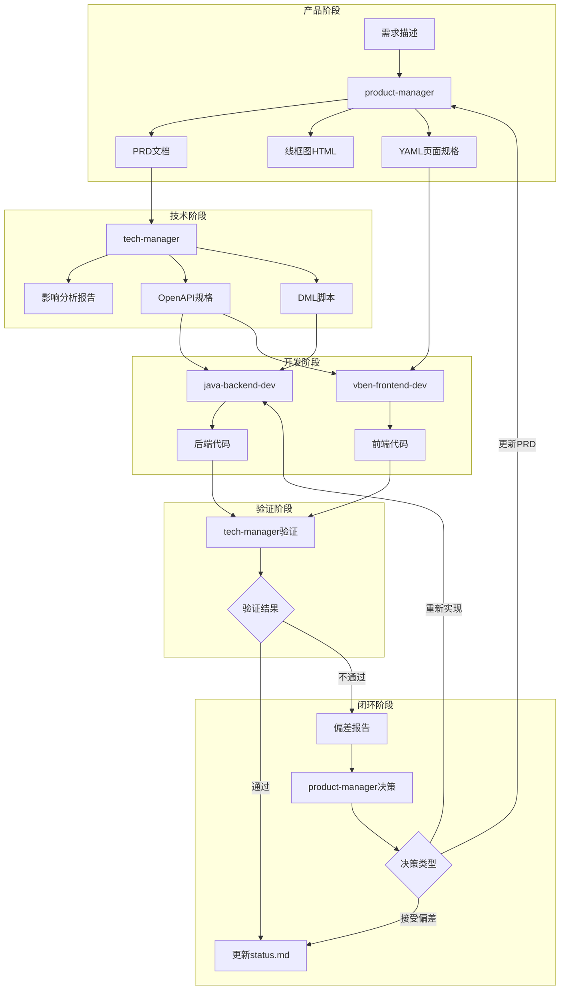

# 分布式协同开发指南 - 概述

本指南定义了使用 dainthub-skills 技能链路进行分布式协同开发的方案。

---

## 适用场景

- 多角色分布式协同开发（产品经理、技术经理、前端开发、后端开发）
- 不同电脑、不同 AI 会话的协作
- 基于 git 作为唯一管理文件记录方式
- 使用技能链路：product-manager → tech-manager → java-backend-dev / vben-frontend-dev

---

## 协同开发核心概念

### 什么是分布式协同开发

分布式协同开发指多个角色（产品经理、技术经理、前端开发、后端开发）在不同电脑、不同 AI 会话中协作完成一个项目。每个角色由独立的 AI 会话承担，通过 git 仓库同步状态，实现跨会话、跨设备的协作。

### 多角色协作链路

协作链路遵循"需求 → 分析 → 开发 → 验证 → 闭环"的流程：

```
产品经理(PM) → 技术经理(TM) → 开发(前端+后端) → 技术经理(TM验证) → 产品经理(PM决策)
```

每个节点对应一个 Skill，职责明确，输入输出标准化：

| 链路节点 | 对应 Skill | 核心职责 |
|---------|-----------|---------|
| 需求定义 | product-manager | PRD编写、线框图、验收标准 |
| 技术分析 | tech-manager | 变更分析、接口规格、DML脚本、任务分发 |
| 后端开发 | java-backend-dev | Controller/Service/Mapper 实现 |
| 前端开发 | vben-frontend-dev | Vue 页面、表单/表格组件 |
| 实现验证 | tech-manager | 对照 PRD 验证代码实现 |
| 偏差决策 | product-manager | 评估偏差影响、做出决策 |

### 单文件状态管理

**核心原则**：AI 拉取后只读取 `docs/status.md` 一个文件，无需遍历多个 index.md。

status.md 包含：
- 各模块当前状态表（PRD、OpenAPI、DML、线框图、验证、偏差、决策）
- 待处理项汇总（类型、模块、文件路径、处理角色）
- 最近变更记录（最近 5 条提交）
- 下一步任务（角色、任务、输入文件、输出文件）

这种设计确保 AI 在任何会话中都能快速了解全局状态，避免信息碎片化。

### Git 作为唯一协作介质

所有协作通过 git 仓库完成：

| 操作 | 协作意义 |
|------|---------|
| git push | 发布产出物（PRD、OpenAPI、DML、代码） |
| git pull | 获取最新状态，读取 status.md 了解待处理项 |
| git commit | 记录变更，更新 status.md 的"最近变更"表 |

**不使用**：共享文档、即时通讯、云存储。git 是唯一的状态同步介质。

### AI 会话间通信模式

不同 AI 会话通过文件传递信息：

| 通信场景 | 介质文件 | 发送方 | 接收方 |
|---------|---------|-------|-------|
| PRD交付 | prd-{模块}-v{版本}.md | product-manager | tech-manager |
| 接口规格交付 | openapi-{模块}-v{版本}.yaml | tech-manager | 开发 |
| DML脚本交付 | dml-{模块}-v{版本}.sql | tech-manager | java-backend-dev |
| 页面规格交付 | wireframes-{模块}-v{版本}.yaml | product-manager | vben-frontend-dev |
| 偏差反馈 | deviation-{模块}-v{版本}.md | tech-manager | product-manager |
| 决策记录 | decision-{议题}-v{版本}.md | product-manager | tech-manager |

---

## 角色与职责定义

### 产品经理 (product-manager)

**职责范围**：
- 需求分析与优先级排序
- PRD 文档撰写（10 章节结构）
- 线框图 HTML + YAML 页面规格生成
- 验收标准定义
- 偏差反馈处理与决策

**关键产出**：
| 产出物 | 文件格式 | 用途 |
|-------|---------|------|
| PRD 文档 | prd-{模块}-v{版本}.md | 交付给 tech-manager 进行技术分析 |
| ER 图 | prd-{模块}-v{版本}-er.md | 数据模型定义 |
| 线框图 | wireframes-{模块}-v{版本}.html | 页面布局可视化 |
| YAML 页面规格 | wireframes-{模块}-v{版本}.yaml | 前端开发输入 |
| 决策记录 | decision-{议题}-v{版本}.md | 偏差处理决策 |

**触发词**：`写PRD`、`需求分析`、`线框图`、`页面原型`、`偏差决策`

### 技术经理 (tech-manager)

**职责范围**：
- 变更影响分析（分析 PRD/接口/数据库变更的影响范围）
- OpenAPI 3.0 接口规格生成
- DML 数据库脚本生成（含回滚脚本）
- 任务分发（并行启动前后端开发）
- 前后端接口对齐
- 实现验证（对照 PRD 验证代码实现）
- 偏差反馈（发现实现偏差，反馈给产品经理）

**关键产出**：
| 产出物 | 文件格式 | 用途 |
|-------|---------|------|
| 影响分析报告 | impact-{模块}-v{版本}.md | 变更影响范围说明 |
| OpenAPI 规格 | openapi-{模块}-v{版本}.yaml | 前后端接口契约 |
| DML 执行脚本 | dml-{模块}-v{版本}.sql | 数据库变更执行 |
| DML 回滚脚本 | dml-{模块}-v{版本}-rollback.sql | 数据库变更回滚 |
| 验证报告 | verify-{模块}-v{版本}.md | 实现验证结果 |
| 偏差报告 | deviation-{模块}-v{版本}.md | 实现偏差反馈 |

**触发词**：`分析影响`、`生成接口文档`、`生成DML`、`分配任务`、`前后端对齐`、`检查实现`、`偏差反馈`

### 后端开发 (java-backend-dev)

**职责范围**：
- Controller/Service/Mapper 层代码开发
- DO/VO/DTO 实体类定义
- 单元测试编写
- SQL 优化与缓存策略

**技术栈**：Spring Boot 3 + MyBatis Plus + MySQL 8

**输入文件**：OpenAPI 规格 + DML 脚本

**触发词**：`后端开发`、`Controller`、`Service`、`Mapper`、`实体`、`接口开发`

### 前端开发 (vben-frontend-dev)

**职责范围**：
- Vue 3 页面组件开发
- VbenForm 表单 Schema 配置
- VxeGrid 表格 Schema 配置
- VbenModal/VbenDrawer 弹窗组件
- 前端测试编写

**技术栈**：Vben Admin 5.x + Vue 3 + Vite + Tailwind CSS

**输入文件**：OpenAPI 规格 + YAML 页面规格

**触发词**：`前端开发`、`列表页`、`表单页`、`VbenForm`、`VxeGrid`、`VbenModal`

---

## 协作流程概览

### 端到端流程图



### 各阶段输入/输出文件

| 阶段 | 角色 | 输入文件 | 输出文件 |
|------|------|---------|---------|
| 需求定义 | product-manager | 需求描述（用户输入） | prd-{模块}-v{版本}.md、wireframes-{模块}-v{版本}.html/yaml |
| 技术分析 | tech-manager | prd-{模块}-v{版本}.md | impact-{模块}-v{版本}.md、openapi-{模块}-v{版本}.yaml、dml-{模块}-v{版本}.sql |
| 后端开发 | java-backend-dev | openapi-{模块}-v{版本}.yaml、dml-{模块}-v{版本}.sql | Controller/Service/Mapper 代码 |
| 前端开发 | vben-frontend-dev | openapi-{模块}-v{版本}.yaml、wireframes-{模块}-v{版本}.yaml | Vue 页面组件 |
| 实现验证 | tech-manager | prd-{模块}-v{版本}.md + 代码 | verify-{模块}-v{版本}.md |
| 偏差反馈 | tech-manager | verify-{模块}-v{版本}.md（不通过项） | deviation-{模块}-v{版本}.md |
| 偏差决策 | product-manager | deviation-{模块}-v{版本}.md | decision-{议题}-v{版本}.md |

### 文件命名规范

| 文件类型 | 命名格式 | 示例 |
|---------|---------|------|
| PRD | `prd-{模块}-v{版本}.md` | prd-product-v1.2.md |
| OpenAPI | `openapi-{模块}-v{版本}.yaml` | openapi-product-v1.2.yaml |
| DML执行 | `dml-{模块}-v{版本}.sql` | dml-product-v1.2.sql |
| DML回滚 | `dml-{模块}-v{版本}-rollback.sql` | dml-product-v1.2-rollback.sql |
| 线框图 | `wireframes-{模块}-v{版本}.html` | wireframes-product-v1.2.html |
| YAML规格 | `wireframes-{模块}-v{版本}.yaml` | wireframes-product-v1.2.yaml |
| 验证报告 | `verify-{模块}-v{版本}.md` | verify-product-v1.2.md |
| 偏差报告 | `deviation-{模块}-v{版本}.md` | deviation-product-v1.2.md |
| 决策记录 | `decision-{议题}-v{版本}.md` | decision-product-sku-v1.2.md |

---

## 初始化检查清单

### 项目目录结构要求

开始协同开发前，确保项目具备以下目录结构：

```
project/
├── docs/                    # 协同开发文档目录（必需）
│   ├── prd/                 # PRD 文档目录
│   ├── api/                 # OpenAPI 目录
│   ├── db/                  # DML 脚本目录
│   ├── wireframes/          # 线框图目录
│   ├── reports/             # 报告目录
│   ├── decisions/           # 决策记录目录
│   ├── archive/             # 归档目录
│   └── status.md            # 状态快照（必需）
├── backend/                 # 后端工程目录
├── frontend/                # 前端工程目录
├── .agents/                 # AI 配置目录
└── AGENTS.md                # 项目级 AI 配置
```

### status.md 初始化

创建 `docs/status.md`，包含以下基础结构：

```markdown
# 项目状态快照

> AI 拉取后只需读取此文件了解全局状态
> 更新时间：{初始化日期}

## 各模块当前状态

| 模块 | PRD | OpenAPI | DML | 线框图 | 验证 | 偏差 | 决策 | 当前阶段 |
|------|-----|---------|-----|--------|------|------|------|---------|
| （待添加模块） | - | - | - | - | - | - | - | ⏸️ 待开始 |

## 待处理项汇总

| 类型 | 模块 | 版本 | 文件路径 | 处理角色 |
|------|------|------|---------|---------|
| （待添加任务） | - | - | - | - |

## 最近变更（最近 5 条）

| 时间 | 提交 | 变更内容 | 影响模块 |
|------|------|---------|---------|
| （初始化时为空） | - | - | - |

## 下一步任务

| 角色 | 任务 | 输入文件 | 输出文件 |
|------|------|---------|---------|
| （待添加任务） | - | - | - |
```

### docs/ 目录配置

每个子目录需创建 `index.md` 索引文件：

| 目录 | index.md 内容 |
|------|--------------|
| docs/prd/ | PRD 文件列表 + 版本状态 |
| docs/api/ | OpenAPI 文件列表 + 版本状态 |
| docs/db/ | DML 文件列表 + 执行状态 |
| docs/wireframes/ | 线框图文件列表 + 版本状态 |
| docs/reports/ | 报告文件列表 |
| docs/decisions/ | 决策记录列表 |

### AI 配置检查

确保 `.agents/AGENTS.md` 或项目根目录 `AGENTS.md` 包含：

- 技能加载路径配置
- 项目特定约束规则
- 协作流程引用

---

## 核心触发指令

### status.md 更新指令

| 触发指令 | AI 执行动作 | 适用场景 |
|---------|------------|---------|
| "更新 status.md" | 更新当前模块状态 + 最近变更 | 完成任务后 |
| "记录提交到 status.md" | 添加最近变更记录 | git commit 后 |
| "更新下一步任务" | 更新"下一步任务"表 | 任务分发/完成后 |
| "新增模块到 status.md" | 添加新模块行 | 开始新模块开发 |

**注意**：AI 不会自动更新 status.md，需要用户显式触发。

### 版本归档指令

| 触发指令 | AI 执行动作 | 适用场景 |
|---------|------------|---------|
| "归档 v1.2" | 移动 v1.2 所有文档到 archive/v1.2/ | 开始新版本前 |
| "开始 v1.3，归档旧版本" | 归档当前 ✅ 版本 + 更新索引 | 版本迭代 |
| "归档 product v1.2" | 只归档指定模块的 v1.2 | 部分归档 |

### 拉取同步指令

| 触发指令 | AI 执行动作 | 适用场景 |
|---------|------------|---------|
| "git pull 同步" | 拉取 + 读取 status.md + 确认待处理项 | 拉取后了解状态 |
| "检查变更" | 读取 status.md + git log | 了解最近变更 |

### 迭代循环指令

| 触发指令 | AI 执行动作 | 适用场景 |
|---------|------------|---------|
| "按优先级完成所有模块" | 批量迭代，自动完成待处理项 | 批量开发 |
| "继续下一个模块" | 单步推进，完成一个待处理项 | 单步推进 |
| "批量完成 {模块名} 全流程" | 单模块完整链路（PRD→开发→验证） | 单模块开发 |

---

## 常见问题

### Q1: 不同 AI 会话如何知道当前状态？

**答**：每个 AI 会话在 git pull 后读取 `docs/status.md`，这是唯一的状态快照文件。status.md 包含各模块状态、待处理项、最近变更、下一步任务，AI 无需遍历其他文件即可了解全局状态。

### Q2: 如果两个角色同时修改同一文件怎么办？

**答**：协作链路设计为串行依赖关系，避免并发冲突：
- PRD 完成后才能进行技术分析
- OpenAPI/DML 完成后才能开始开发
- 开发完成后才能进行验证

同一模块的前后端开发可并行，但各自修改不同文件（后端修改 backend/，前端修改 frontend/）。

### Q3: 偏差处理流程是什么？

**答**：
1. tech-manager 验证实现，发现偏差
2. 生成偏差报告 `deviation-{模块}-v{版本}.md`
3. 更新 status.md，添加待处理项
4. product-manager 读取偏差报告，做出决策
5. 生成决策记录 `decision-{议题}-v{版本}.md`
6. 根据决策类型：更新 PRD / 重新实现 / 接受偏差

### Q4: 如何开始一个新模块的开发？

**答**：
1. 用户向 product-manager 描述需求
2. product-manager 生成 PRD + 线框图 + YAML 规格
3. 更新 status.md，添加新模块行
4. tech-manager 读取 PRD，进行技术分析
5. 生成 OpenAPI + DML，更新 status.md
6. 分发任务给前后端开发

### Q5: status.md 更新时机是什么？

**答**：status.md 需要用户显式触发更新，AI 不会自动更新。推荐更新时机：
- 完成一个阶段任务后（PRD完成、OpenAPI完成、开发完成）
- git commit 后记录变更
- 任务分发后更新"下一步任务"
- 发现偏差后添加待处理项

### Q6: 如何处理跨模块依赖？

**答**：status.md 的"各模块当前状态"表显示依赖关系。tech-manager 在变更分析时会识别跨模块影响，并在影响报告中说明。依赖模块需先完成前置阶段。

### Q7: 归档后如何查看历史版本？

**答**：归档版本保存在 `docs/archive/v{版本}/` 目录，每个归档版本有独立的 index.md 索引。可通过归档索引查看历史版本的 PRD、OpenAPI、DML 等文件。

---

## 文档索引（按需加载）

| 文档 | 内容 | 何时加载 |
|------|------|---------|
| `01-overview.md` | 概述 + 触发指令 | 首次了解协作方案 |
| `02-project-structure.md` | 项目整体目录结构 | 项目初始化 |
| `03-frontend-backend.md` | 前后端工程目录结构 | 开始开发前 |
| `04-git-workflow.md` | git 工作流 + 版本号规范 | 创建分支/提交时 |
| `05-status-mechanism.md` | status.md + 归档机制 | 更新状态/归档时 |
| `06-sync-flow.md` | 拉取同步流程 | git pull 后 |
| `07-examples.md` | 协作场景示例 | 了解完整流程时 |
| `08-ai-config.md` | AI 配置 + 检查清单 | 项目初始化 |
| `09-iteration-workflow.md` | 迭代循环工作流 | 批量开发 |
| `10-skill-router.md` | 角色→Skill映射 + 路由规则 | 循环执行时 / 了解角色职责 |
| `11-blocking-handler.md` | 阻塞处理规范 | 遇到阻塞时 |
| `12-status-update-templates.md` | 状态更新模板 | skill 完成后 |
| `testing-collaboration.md` | 测试协作框架 | 开发过程中 |

---

## 版本

- v1.1
- 更新: 2026-04-14
- 变更: 扩展核心概念、角色职责、协作流程、初始化检查清单、FAQ